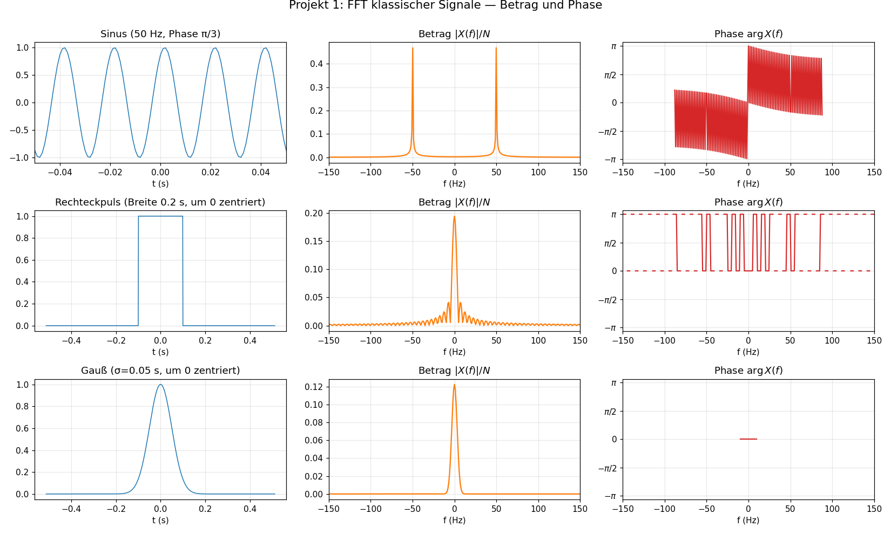
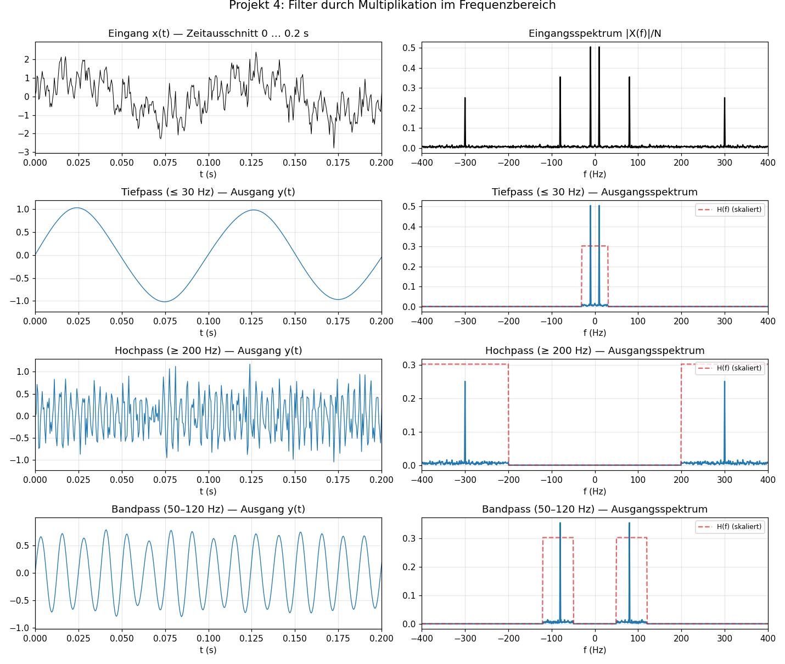

# Kurs: Euler-Formel, Fourier- und Hilbert-Transformation

Dies ist der inhaltliche Teil des Kurses. Ein Überblick über Zielgruppe und Lernziele steht in der [Projekt-README](../README.md).

## Einheiten

| Einheit | Thema | Kernidee |
| --- | --- | --- |
| [1](einheit-1.md) | Komplexe Zahlen und Euler-Formel | Rotation und Schwingung sind dieselbe Struktur |
| [2](einheit-2.md) | Fourier-Reihen | Periodische Signale als Summe komplexer Schwingungen |
| [3](einheit-3.md) | Fourier-Transformation | Nichtperiodische Signale als kontinuierliches Frequenzspektrum |
| [4](einheit-4.md) | Eigenschaften der Fourier-Transformation | Verschieben, Skalieren, Falten, Ableiten |
| [5](einheit-5.md) | Diskrete Signale, DFT und FFT | Abtastung und Nyquist-Grenze |
| [6](einheit-6.md) | Hilbert-Transformation | Frequenzabhängige Phasenverschiebung um 90 Grad |
| [7](einheit-7.md) | Analytisches Signal | Amplitude, Phase und Momentanfrequenz |
| [8](einheit-8.md) | Gemeinsames Bild | Verknüpfung aller drei Themen mit Abschlussaufgaben |

Die Lösungen zu allen Übungen und Abschlussaufgaben stehen separat in [`loesungen/`](loesungen/README.md). Die Python-Skripte hinter den Abbildungen liegen in [`scripts/`](scripts/README.md); erzeugte PNGs in `bilder/`.

## Lernfortschritt

| Einheit | Du solltest danach können ... |
| --- | --- |
| 1 | komplexe Zahlen zwischen Algebra, Geometrie und Schwingung übersetzen |
| 2 | periodische Signale als Projektionen auf orthogonale Schwingungen deuten |
| 3 | Spektren nichtperiodischer Signale qualitativ und rechnerisch lesen |
| 4 | Zeitoperationen im Frequenzbereich vorhersagen und Parseval als Energieerhaltung interpretieren |
| 5 | DFT-Bins, FFT, Nyquist-Grenze und Aliasing an konkreten Zahlen erklären |
| 6 | die Hilbert-Transformation als 90-Grad-Phasenoperator im Frequenzbereich beschreiben |
| 7 | aus dem analytischen Signal Hüllkurve, Phase und Momentanfrequenz gewinnen und die Bedrosian-Bedingung prüfen |
| 8 | Euler, Fourier und Hilbert in einem zusammengesetzten Signal gemeinsam einsetzen |

## Konventionen und Voraussetzungen

Damit der Kurs handlich bleibt, treffen wir an ein paar Stellen feste Entscheidungen:

- **Fourier-Konvention.** Wir verwenden die Kreisfrequenz \(\omega=2\pi f\) und die unsymmetrische Form
  $$
  X(\omega)=\int_{-\infty}^{\infty} x(t)e^{-i\omega t}\,dt,\qquad
  x(t)=\frac{1}{2\pi}\int_{-\infty}^{\infty} X(\omega)e^{i\omega t}\,d\omega.
  $$
  In der Literatur findet man auch die Variante in \(f\) (kein Vorfaktor \(1/2\pi\)) oder die symmetrische Variante mit \(1/\sqrt{2\pi}\) auf beiden Seiten. Die Sätze sind in jeder Konvention richtig, die Vorfaktoren in einzelnen Formeln können sich aber unterscheiden.
- **Kreisfrequenz vs. Frequenz.** Im theoretischen Teil rechnen wir meist mit \(\omega\) in rad/s, weil \(e^{i\omega t}\) die Formeln knapp macht. In numerischen Beispielen, Akustik und Abtastung verwenden wir oft \(f\) in Hertz. Die Umrechnung ist immer
  $$
  \omega=2\pi f,\qquad f=\frac{\omega}{2\pi}.
  $$
  Wenn also \(\cos(8t)\) ohne \(2\pi\) geschrieben ist, ist \(8\) eine Kreisfrequenz; \(\cos(2\pi\cdot 8\,t)\) meint dagegen \(8\,\text{Hz}\).
- **DFT-Konvention.** Die DFT ist ohne Vorfaktor definiert, die inverse DFT trägt den Faktor \(1/N\). NumPy (`numpy.fft`) und MATLAB folgen dieser Wahl; SciPys `scipy.fft` ebenfalls.
- **Regularität.** Wir behandeln Konvergenz- und Integrierbarkeitsfragen nicht im Detail. Alle Aussagen gelten unter den üblichen Voraussetzungen (z. B. \(L^1\cap L^2\) für die Fourier-Transformation, hinreichend abklingende und differenzierbare Funktionen bei der Ableitungsregel). Für \(\delta\) und für reine Schwingungen \(e^{i\omega_0 t}\) interpretiert man die Aussagen distributionentheoretisch.
- **Notation.** Realteil/Imaginärteil als \(\operatorname{Re}, \operatorname{Im}\); komplex Konjugiertes als \(\overline{z}\). Phase und Argument werden synonym verwendet.

## Einheitsschema und Arbeitsweise

Jede Einheit folgt demselben Muster: Leitfrage, Definition, Beweisidee oder Beispiel, Visualisierung, Übungen, Selbstcheck und Querverweise. Für Selbststudium ist eine Einheit auf ungefähr zwei Stunden Lesen und eine Stunde Üben ausgelegt. In einer 90-Minuten-Sitzung eignen sich die Beispiele als gemeinsamer Kern; Übungen und Selbstcheck bleiben dann als Nacharbeit.

## Empfohlene Reihenfolge beim Lernen

1. Euler-Formel sicher verstehen.
2. Komplexe Exponentialfunktionen als Schwingungen interpretieren.
3. Fourier-Reihen für periodische Signale üben.
4. Fourier-Transformation als Grenzfall für nichtperiodische Signale verstehen.
5. Eigenschaften der Fourier-Transformation anwenden.
6. Hilbert-Transformation zuerst im Frequenzbereich verstehen.
7. Analytisches Signal für Hüllkurve, Phase und Momentanfrequenz nutzen.

## Glossar

| Symbol | Bedeutung | Erstes Vorkommen |
| --- | --- | --- |
| \(i\) | imaginäre Einheit, \(i^2=-1\) | [§1.1](einheit-1.md#11-komplexe-zahlen) |
| \(z=a+ib\) | komplexe Zahl mit Real- und Imaginärteil | [§1.1](einheit-1.md#11-komplexe-zahlen) |
| \(|z|\), \(\arg z\) | Betrag und Phase einer komplexen Zahl | [§1.1](einheit-1.md#11-komplexe-zahlen) |
| \(e^{i\varphi}\) | Punkt auf dem Einheitskreis, rotierender Zeiger | [§1.3](einheit-1.md#13-euler-formel) |
| \(T\), \(\omega_0\) | Periode und Grundkreisfrequenz \(2\pi/T\) | [§2.1](einheit-2.md#21-grundidee) |
| \(c_n\) | Fourier-Reihen-Koeffizient der \(n\)-ten Harmonischen | [§2.2](einheit-2.md#22-komplexe-fourier-reihe) |
| \(X(\omega)\) | Fourier-Transformierte von \(x(t)\) | [§3.2](einheit-3.md#32-definition) |
| \(H(\omega)\) | Frequenzgang eines Filters oder LTI-Systems | [§4.6](einheit-4.md#46-faltung) |
| \(f_s\), \(f_N\) | Abtastrate und Nyquist-Frequenz | [§5.5](einheit-5.md#55-abtastung-und-nyquist-grenze) |
| \(\mathcal H\{x\}\) | Hilbert-Transformierte von \(x\) | [§6.2](einheit-6.md#62-definition-im-frequenzbereich) |
| \(z(t)=x(t)+i\mathcal H\{x\}(t)\) | analytisches Signal | [§7.1](einheit-7.md#71-definition) |
| \(\phi(t)\), \(f_{\text{inst}}\) | momentane Phase und Momentanfrequenz | [§7.5](einheit-7.md#75-momentane-phase) |

## Anwendungsanker

- **Akustik:** Spektren erklären Klangfarbe, Filter und Obertöne.
- **Nachrichtentechnik:** Modulation, AM-Signale und Hüllkurven nutzen direkt Fourier- und Hilbert-Werkzeuge.
- **Bildverarbeitung:** Faltung und Frequenzfilter wirken genauso, nur mit zwei Ortsvariablen statt einer Zeitvariablen.
- **Quantenmechanik:** Wellenfunktion und Impulsraum sind Fourier-Paare; die Gaußfunktion zeigt die Unschärfe besonders klar.
- **Systemtheorie:** LTI-Systeme werden im Frequenzbereich durch Multiplikation mit \(H(\omega)\) beschrieben.

## Weiterführende Projektideen

1. **FFT klassischer Signale — Betrag und Phase.**
   Erzeuge Sinus, Rechteck und Gauß und visualisiere jeweils Zeitsignal, Betragsspektrum und Phasenspektrum. Lerneffekt: gerade Signale haben Phase 0 oder ±π, ungerade ±π/2; Zeitverschiebung erzeugt lineare Phase.
   *Referenz-Implementation:* [`scripts/projekte/projekt-1-fft-signale.py`](scripts/projekte/projekt-1-fft-signale.py) → 

2. **Hilbert-Hüllkurve eines AM-Signals.**
   Simuliere \(x(t)=(1+0{,}5\cos(2\pi f_m t))\cos(2\pi f_c t)\) und extrahiere die Hüllkurve mit der Hilbert-Transformation.
   *Bereits als Visualisierung in [Einheit 7](einheit-7.md#78-visualisierung) durchgespielt.* Eigene Vertiefung: andere \(A(t)\), Spektralüberlappung, Bedrosian-Bedingung verletzen.

3. **Phasenanalyse eines Chirp-Signals.**
   Berechne die entfaltete Phase und daraus die Momentanfrequenz.
   *Bereits als Visualisierung in [Einheit 8](einheit-8.md#83-visualisierung-alles-auf-einmal) durchgespielt.* Eigene Vertiefung: exponentieller Chirp, Mehrkomponenten-Signal, Randeffekte mit Fensterung dämpfen.

4. **Filter im Frequenzbereich.**
   Implementiere Tiefpass, Hochpass und Bandpass über Multiplikation des Spektrums mit einer Übertragungsfunktion. Untersuche die Gibbs-Artefakte rechteckiger Filter.
   *Referenz-Implementation:* [`scripts/projekte/projekt-4-filter.py`](scripts/projekte/projekt-4-filter.py) → 
