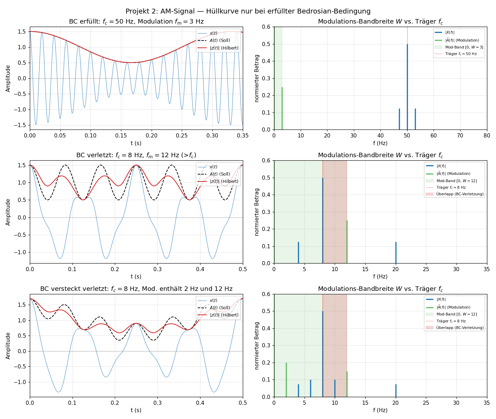
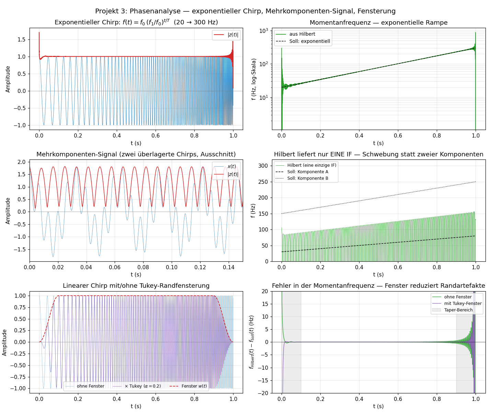

# Kurs: Euler-Formel, Fourier- und Hilbert-Transformation

Dies ist der inhaltliche Teil des Kurses. Ein Überblick über Zielgruppe und Lernziele steht in der [Projekt-README](../README.md).

## Einheiten

| Einheit | Thema | Kernidee |
| --- | --- | --- |
| [1](einheit-1.md) | Komplexe Zahlen und Euler-Formel | Rotation und Schwingung sind dieselbe Struktur |
| [2](einheit-2.md) | Fourier-Reihen | Periodische Signale als Summe komplexer Schwingungen |
| [3](einheit-3.md) | Fourier-Transformation | Nichtperiodische Signale als kontinuierliches Frequenzspektrum |
| [4a](einheit-4a.md) | Eigenschaften der Fourier-Transformation: Verschieben, Modulieren, Skalieren, Ableiten | Punktweise Regeln, die Phase oder Spektrum-Lage verändern |
| [4b](einheit-4b.md) | Eigenschaften der Fourier-Transformation: Faltung, Energie, Symmetrien | Strukturregeln, die zwei Signale oder zwei Repräsentationen verbinden |
| [5](einheit-5.md) | Diskrete Signale, DFT und FFT | Bins, Leckage, Fensterung und Nyquist-Grenze |
| [6](einheit-6.md) | Hilbert-Transformation | Frequenzabhängige Phasenverschiebung um 90 Grad |
| [7](einheit-7.md) | Analytisches Signal | Amplitude, Phase und Momentanfrequenz |
| [8](einheit-8.md) | Gemeinsames Bild | Verknüpfung aller drei Themen mit Abschlussaufgaben |

Die Lösungen zu allen Übungen und Abschlussaufgaben stehen separat in [`loesungen/`](loesungen/README.md). Die Python-Skripte hinter den Abbildungen liegen in [`scripts/`](scripts/README.md); erzeugte PNGs in `bilder/`.

## Lernfortschritt

| Einheit | Du solltest danach können ... |
| --- | --- |
| 1 | komplexe Zahlen zwischen Algebra, Geometrie und Schwingung übersetzen |
| 2 | periodische Signale als Projektionen auf orthogonale Schwingungen deuten |
| 3 | Spektren nichtperiodischer Signale qualitativ und rechnerisch lesen |
| 4a | Verschiebungs-, Modulations-, Skalierungs- und Ableitungsregel im Frequenzbereich anwenden und kombinieren |
| 4b | Faltung im Frequenzbereich als Multiplikation lesen, Parseval als Energieerhaltung interpretieren und Symmetrien als Diagnosewerkzeug nutzen |
| 5 | DFT-Bins, FFT, Binauflösung, Spektralleckage, Nyquist-Grenze und Aliasing an konkreten Zahlen erklären |
| 6 | die Hilbert-Transformation als 90-Grad-Phasenoperator im Frequenzbereich beschreiben |
| 7 | aus dem analytischen Signal Hüllkurve, Phase und Momentanfrequenz gewinnen und die Bedrosian-Bedingung prüfen |
| 8 | Euler, Fourier und Hilbert in einem zusammengesetzten Signal gemeinsam einsetzen |

## Constructive-Alignment-Matrix

Die folgende Tabelle verknüpft jedes Lernziel mit dem Ort der Einführung, einer Übung zur aktiven Bearbeitung, einem Selbstcheck-Eintrag zur formativen Selbstdiagnose und einer Aufgabe in Einheit 8 zur summativen Klammer. Die Spalte "Bloom" gibt die Kompetenzstufe nach Anderson-Krathwohl an (Apply, Analyze, Evaluate, Create).

| Lernziel | Einführung | Übung | Selbstcheck | Endaufgabe | Bloom |
| --- | --- | --- | --- | --- | --- |
| L1.1 Komplexe Zahlen ↔ Polarform ↔ Punkt in $\mathbb C$ | [§1.1–§1.3](einheit-1.md#11-komplexe-zahlen) | [§1, Ü1](einheit-1.md#übungen-zu-einheit-1) | [§1, SC1](einheit-1.md#selbstcheck-zu-einheit-1) | [§8, A1](einheit-8.md#aufgabe-1) | Apply |
| L1.2 Euler-Formel geometrisch deuten | [§1.5](einheit-1.md#15-geometrische-bedeutung) | [§1, Ü4](einheit-1.md#übungen-zu-einheit-1) | [§1, SC4](einheit-1.md#selbstcheck-zu-einheit-1) | [§8, A1](einheit-8.md#aufgabe-1) | Understand/Apply |
| L1.3 Fehlvorstellung "$e^{i\varphi}$ reell positiv" korrigieren | [§1.5](einheit-1.md#15-geometrische-bedeutung) | [§1, Ü6](einheit-1.md#übungen-zu-einheit-1) | [§1, SC6](einheit-1.md#selbstcheck-zu-einheit-1) | [§8, A8.1](einheit-8.md#aufgabe-8-fehleranalyse) | Evaluate |
| L2.1 Fourier-Koeffizient als Projektion | [§2.3](einheit-2.md#23-warum-funktioniert-das) | [§2, Ü1–Ü2](einheit-2.md#übungen-zu-einheit-2) | [§2, SC1–SC2](einheit-2.md#selbstcheck-zu-einheit-2) | [§8, A6a](einheit-8.md#aufgabe-6-synthese-euler-fourier-hilbert-auf-einen-schlag) | Apply |
| L2.2 Realitätsbedingung $c_{-n}=\overline{c_n}$ | [§2.7](einheit-2.md#27-betrag-und-phase) | [§2, Ü3, Ü6](einheit-2.md#übungen-zu-einheit-2) | [§2, SC6](einheit-2.md#selbstcheck-zu-einheit-2) | [§8, A8.2](einheit-8.md#aufgabe-8-fehleranalyse) | Evaluate |
| L2.3 Symmetrie ↔ Koeffizientenstruktur | [§2.6](einheit-2.md#26-beispiel-mit-integral-rechteckwelle) | [§2, Ü5, Ü7](einheit-2.md#übungen-zu-einheit-2) | [§2, SC5](einheit-2.md#selbstcheck-zu-einheit-2) | [§8, A8-Bonus](einheit-8.md#aufgabe-8-fehleranalyse) | Analyze |
| L3.1 Fourier-Transformierte berechnen | [§3.2, §3.6, §3.7](einheit-3.md#32-definition) | [§3, Ü2, Ü7](einheit-3.md#übungen-zu-einheit-3) | [§3, SC2](einheit-3.md#selbstcheck-zu-einheit-3) | [§8, A2](einheit-8.md#aufgabe-2) | Apply |
| L3.2 Zeit-Frequenz-Dualität qualitativ vorhersagen | [§3.6, §3.7](einheit-3.md#36-beispiel-rechteckpuls) | [§3, Ü3, Ü5, Ü8](einheit-3.md#übungen-zu-einheit-3) | [§3, SC3, SC4](einheit-3.md#selbstcheck-zu-einheit-3) | (Voraussetzung für A6) | Analyze |
| L3.3 Dirac als Distribution (nicht "$\delta(0)=\infty$") | [§3.4](einheit-3.md#34-beispiel-dirac-impuls) | [§3, Ü6](einheit-3.md#übungen-zu-einheit-3) | [§3, SC6](einheit-3.md#selbstcheck-zu-einheit-3) | [§8, A8.3](einheit-8.md#aufgabe-8-fehleranalyse) | Evaluate |
| L4a.1 Zeitverschiebung ↔ Phase, Frequenz­verschiebung ↔ Lage | [§4a.2, §4a.3](einheit-4a.md#4a2-zeitverschiebung) | [§4a, Ü1, Ü4](einheit-4a.md#übungen-zu-einheit-4a) | [§4a, SC1, SC2](einheit-4a.md#selbstcheck-zu-einheit-4a) | [§8, A6a, A6b](einheit-8.md#aufgabe-6-synthese-euler-fourier-hilbert-auf-einen-schlag) | Apply |
| L4a.2 Skalierungs- und Ableitungsregel | [§4a.4, §4a.5](einheit-4a.md#4a4-skalierung) | [§4a, Ü2](einheit-4a.md#übungen-zu-einheit-4a) | [§4a, SC3, SC4](einheit-4a.md#selbstcheck-zu-einheit-4a) | (eingebaut in §4a.6) | Apply |
| L4a.3 Operationen kombinieren, Reihenfolge begründen | [§4a.6](einheit-4a.md#4a6-integrierendes-beispiel-alle-regeln-in-einem-signal) | [§4a, Ü3, Ü4 (Transfer)](einheit-4a.md#übungen-zu-einheit-4a) | [§4a, SC5](einheit-4a.md#selbstcheck-zu-einheit-4a) | (latent in A6/A10) | Analyze |
| L4a.4 Modulationsregel (zwei Kopien!) | [§4a.3](einheit-4a.md#4a3-frequenzverschiebung) | [§4a, Ü6](einheit-4a.md#übungen-zu-einheit-4a) | [§4a, SC2](einheit-4a.md#selbstcheck-zu-einheit-4a) | [§8, A8.4](einheit-8.md#aufgabe-8-fehleranalyse) | Evaluate |
| L4b.1 Faltung ↔ Multiplikation, LTI-Frequenzgang | [§4b.1](einheit-4b.md#4b1-faltung) | [§4b, Ü1–Ü3](einheit-4b.md#übungen-zu-einheit-4b) | [§4b, SC1, SC4](einheit-4b.md#selbstcheck-zu-einheit-4b) | [§8, A4](einheit-8.md#aufgabe-4) | Apply/Analyze |
| L4b.2 Parseval / Energieerhaltung | [§4b.2](einheit-4b.md#4b2-parseval-identität-plancherel) | [§4b, Ü5, Ü7](einheit-4b.md#übungen-zu-einheit-4b) | [§4b, SC2](einheit-4b.md#selbstcheck-zu-einheit-4b) | [§8, A8.5](einheit-8.md#aufgabe-8-fehleranalyse) | Evaluate |
| L4b.3 Symmetrie­tabelle als Diagnose­werkzeug | [§4b.3](einheit-4b.md#4b3-symmetrien-reeller-und-geraderungerader-signale) | [§4b, Ü6](einheit-4b.md#übungen-zu-einheit-4b) | [§4b, SC3, SC5](einheit-4b.md#selbstcheck-zu-einheit-4b) | [§8, A8-Bonus](einheit-8.md#aufgabe-8-fehleranalyse) | Analyze |
| L5.1 DFT vs. FFT, Bin → physikalische Frequenz | [§5.2–§5.4](einheit-5.md#52-definition-der-dft) | [§5, Ü1, Ü4](einheit-5.md#übungen-zu-einheit-5) | [§5, SC1, SC2, SC8](einheit-5.md#selbstcheck-zu-einheit-5) | [§8, A9](einheit-8.md#aufgabe-9-code-synthese) | Apply |
| L5.2 Auflösung vs. Bin-Dichte (Zero Padding) | [§5.5](einheit-5.md#55-frequenzauflösung-leckage-und-fensterung) | [§5, Ü6, Ü7, Ü9](einheit-5.md#übungen-zu-einheit-5) | [§5, SC3, SC5](einheit-5.md#selbstcheck-zu-einheit-5) | [§8, A8.6](einheit-8.md#aufgabe-8-fehleranalyse) | Evaluate |
| L5.3 Nyquist-Grenze, Aliasing | [§5.6](einheit-5.md#56-abtastung-und-nyquist-grenze) | [§5, Ü2, Ü3, Ü5](einheit-5.md#übungen-zu-einheit-5) | [§5, SC6, SC7](einheit-5.md#selbstcheck-zu-einheit-5) | [§8, A5](einheit-8.md#aufgabe-5) | Apply/Analyze |
| L5.4 Kohärente Abtastung, Spektralleckage | [§5.5](einheit-5.md#55-frequenzauflösung-leckage-und-fensterung) | [§5, Ü8, Ü9, Ü10](einheit-5.md#übungen-zu-einheit-5) | [§5, SC4](einheit-5.md#selbstcheck-zu-einheit-5) | (latent in A9) | Analyze/Create |
| L6.1 Hilbert als Frequenzgang $-i\thinspace\mathrm{sgn}(\omega)$ | [§6.2](einheit-6.md#62-definition-im-frequenzbereich) | [§6, Ü1–Ü3, Ü7](einheit-6.md#übungen-zu-einheit-6) | [§6, SC1–SC3](einheit-6.md#selbstcheck-zu-einheit-6) | [§8, A3](einheit-8.md#aufgabe-3) | Apply |
| L6.2 Zeitbereichsform, Hauptwert, LTI-Sicht | [§6.3](einheit-6.md#63-definition-im-zeitbereich) | [§6, Ü4, Ü5](einheit-6.md#übungen-zu-einheit-6) | [§6, SC4, SC5](einheit-6.md#selbstcheck-zu-einheit-6) | (Hintergrund für §7) | Understand/Analyze |
| L6.3 DC-Sonderbehandlung | [§6.5](einheit-6.md#65-zweimalige-hilbert-transformation) | [§6, Ü6, Ü8](einheit-6.md#übungen-zu-einheit-6) | [§6, SC6](einheit-6.md#selbstcheck-zu-einheit-6) | [§8, A8.7](einheit-8.md#aufgabe-8-fehleranalyse) | Evaluate/Create |
| L7.1 Analytisches Signal bilden | [§7.1, §7.2](einheit-7.md#71-definition) | [§7, Ü1, Ü7](einheit-7.md#übungen-zu-einheit-7) | [§7, SC1, SC3](einheit-7.md#selbstcheck-zu-einheit-7) | [§8, A3, A6c](einheit-8.md#aufgabe-3) | Apply |
| L7.2 Hüllkurve, Phase, Momentanfrequenz lesen | [§7.4–§7.6](einheit-7.md#74-hüllkurve) | [§7, Ü2, Ü3, Ü8](einheit-7.md#übungen-zu-einheit-7) | [§7, SC4](einheit-7.md#selbstcheck-zu-einheit-7) | [§8, A9](einheit-8.md#aufgabe-9-code-synthese) | Apply/Analyze |
| L7.3 DC/Nyquist-Bins in DFT-Implementation | [§7.2](einheit-7.md#72-frequenzbereich) | [§7, Ü7](einheit-7.md#übungen-zu-einheit-7) | [§7, SC3](einheit-7.md#selbstcheck-zu-einheit-7) | (relevant für A9) | Apply |
| L7.4 Bedrosian-Bedingung prüfen | [§7.7](einheit-7.md#77-typische-anwendung-am-signal) | [§7, Ü5 (Konstr.), Ü6 (Fehlerdiagn.), Ü8 (Code)](einheit-7.md#übungen-zu-einheit-7) | [§7, SC5, SC6](einheit-7.md#selbstcheck-zu-einheit-7) | [§8, A6c, A8.8, A10](einheit-8.md#aufgabe-6-synthese-euler-fourier-hilbert-auf-einen-schlag) | Evaluate/Create |
| L8.1 Drei Werkzeuge gemeinsam auf einem Signal einsetzen | [§8.1, §8.3](einheit-8.md#81-die-verbindung-der-drei-themen) | (alle §8-Aufgaben) | [§8, AbschlussSC](einheit-8.md#abschluss-selbstcheck) | [§8, A6, A9, A10](einheit-8.md#aufgabe-6-synthese-euler-fourier-hilbert-auf-einen-schlag) | Analyze/Create |
| L8.2 Reflexion über die Werkzeugwahl | [§8.2](einheit-8.md#82-merksätze) | (Reflexionsaufgabe) | [§8, AbschlussSC](einheit-8.md#abschluss-selbstcheck) | [§8, A7](einheit-8.md#aufgabe-7-reflexion) | Evaluate |

**Wie man die Matrix benutzt.** Wer ein Lernziel noch nicht erreicht hat, findet in einer Zeile alle vier Eingriffsstellen — von Erklärung über aktive Bearbeitung bis zur summativen Kontrolle. Wer einen Selbstcheck-Eintrag *nicht* abhaken kann, sieht in derselben Zeile, welche Übung das Defizit gezielt addressiert. Lehrende können die Matrix für Prüfungs­planung verwenden: Eine ausgewogene Klausur deckt mindestens eine Aufgabe pro Bloom-Stufe ab, und die Endaufgaben-Spalte zeigt, welche §8-Aufgabe welches Lernziel summativ prüft.

## Konventionen und Voraussetzungen

Damit der Kurs handlich bleibt, treffen wir an ein paar Stellen feste Entscheidungen:

- **Fourier-Konvention.** Wir verwenden die Kreisfrequenz $\omega=2\pi f$ und die unsymmetrische Form
  $$X(\omega)=\int_{-\infty}^{\infty} x(t)e^{-i\omega t}\thinspace dt,\qquad x(t)=\frac{1}{2\pi}\int_{-\infty}^{\infty} X(\omega)e^{i\omega t}\thinspace d\omega.$$
  In der Literatur findet man auch die Variante in $f$ (kein Vorfaktor $1/2\pi$) oder die symmetrische Variante mit $1/\sqrt{2\pi}$ auf beiden Seiten. Die Sätze sind in jeder Konvention richtig, die Vorfaktoren in einzelnen Formeln können sich aber unterscheiden.
- **Kreisfrequenz vs. Frequenz.** Im theoretischen Teil rechnen wir meist mit $\omega$ in rad/s, weil $e^{i\omega t}$ die Formeln knapp macht. In numerischen Beispielen, Akustik und Abtastung verwenden wir oft $f$ in Hertz. Die Umrechnung ist immer
  $$\omega=2\pi f,\qquad f=\frac{\omega}{2\pi}.$$
  Wenn also $\cos(8t)$ ohne $2\pi$ geschrieben ist, ist $8$ eine Kreisfrequenz; $\cos(2\pi\cdot 8\thinspace t)$ meint dagegen $8\thinspace \text{Hz}$.
- **DFT-Konvention.** Die DFT ist ohne Vorfaktor definiert, die inverse DFT trägt den Faktor $1/N$. NumPy (`numpy.fft`) und MATLAB folgen dieser Wahl; SciPys `scipy.fft` ebenfalls.
- **Hilbert-Konvention.** Wir verwenden die in Signalverarbeitung und Nachrichtentechnik übliche Wahl mit Frequenzgang
  $$\mathcal F\lbrace\mathcal H\lbrace x\rbrace\rbrace(\omega)=-i\thinspace\mathrm{sgn}(\omega)X(\omega),$$
  sodass $\mathcal H\lbrace\cos(\omega_0 t)\rbrace=\sin(\omega_0 t)$ für $\omega_0>0$ gilt. In Teilen der mathematischen Literatur findet man die Gegenkonvention mit $+i\thinspace\mathrm{sgn}(\omega)$; dann tauschen die Rollen von $\sin$ und $-\sin$. Wer Lehrbücher vergleicht, sollte vor jeder Identität das Vorzeichen prüfen.
- **Regularität.** Wir behandeln Konvergenz- und Integrierbarkeitsfragen nicht im Detail. Alle Aussagen gelten unter den üblichen Voraussetzungen (z. B. $L^1\cap L^2$ für die Fourier-Transformation, hinreichend abklingende und differenzierbare Funktionen bei der Ableitungsregel). Für $\delta$ und für reine Schwingungen $e^{i\omega_0 t}$ interpretiert man die Aussagen distributionentheoretisch.
- **Notation.** Realteil/Imaginärteil als $\mathrm{Re}, \mathrm{Im}$; komplex Konjugiertes als $\overline{z}$. Phase und Argument werden synonym verwendet.

## Voraussetzungscheck (diagnostischer Pre-Test)

Bevor du in Einheit 1 startest, solltest du die folgenden Aufgaben ohne längere Recherche lösen können. Sie sind als **Selbstdiagnose** gedacht, nicht als Prüfung: jede Aufgabe ist einem Themenbereich zugeordnet, sodass du am Ergebnis ablesen kannst, wo es sich lohnt, vor dem Kurs etwas Zeit zu investieren.

| # | Aufgabe | Themenbereich |
| --- | --- | --- |
| 1 | Wandle $3(\cos(\pi/6)+i\sin(\pi/6))$ in Real- und Imaginärteil um. | Komplexe Zahlen, Polarform |
| 2 | Erkläre, warum $\sin(2\pi f t)$ bei Frequenz $f$ die Kreisfrequenz $\omega=2\pi f$ hat. | Trigonometrie, Bogenmaß |
| 3 | Berechne $\int_{-1}^{1} e^{-i\omega t}\thinspace dt$ bis auf den Grenzwert bei $\omega=0$. | Integralrechnung |
| 4 | Erkläre an zwei Vektoren in $\mathbb R^2$, was Orthogonalität und Projektion bedeuten. | Lineare Algebra |
| 5 | Lies in Python oder Pseudocode aus einer Liste $x[0],\ldots,x[N-1]$ den Mittelwert aus. | Programmierung |

**Auswertungsleitfaden.** Zähle, wie viele Aufgaben du **ohne Nachschlagen in unter zehn Minuten insgesamt** sicher lösen kannst:

- **5 von 5 richtig** — Voraussetzungen sind vollständig erfüllt. Starte direkt mit [Einheit 1](einheit-1.md); der Kurs dürfte im veranschlagten Zeitbudget machbar sein.
- **3–4 richtig** — Voraussetzungen tragen. Identifiziere den ausgelassenen Themenbereich oben in der Spalte "Themenbereich" und plane für die zugehörigen Einheiten **etwa 50 % mehr Lesezeit** ein. Konkrete Empfehlung pro Lücke:
  - **#1 oder #2 offen** → Frische komplexe Zahlen und Bogenmaß auf, bevor du [Einheit 1](einheit-1.md) beginnst (ohne diese Grundlagen wird Einheit 1 deutlich schwerer).
  - **#3 offen** → Plane für [Einheit 2](einheit-2.md) und [Einheit 3](einheit-3.md) Extra-Zeit ein und arbeite die Beispielintegrale aktiv mit Stift und Papier mit.
  - **#4 offen** → Plane für [Einheit 2](einheit-2.md) Extra-Zeit ein; die Projektionsidee aus §2.3 ist sonst die Stolperfalle Nummer eins.
  - **#5 offen** → Python-Abschnitte sind optional; behandle sie als kommentierte Beispiele, der mathematische Kurs funktioniert auch ohne Code-Mitarbeit.
- **0–2 richtig** — Die Voraussetzungen sind nicht ausreichend. Empfehlung: Hole erst die **Analysis-/Lineare-Algebra-Basis** nach (Aufgaben 1, 2, 3, 4) und komm dann zurück. Der Kurs ist sonst frustrierender als nötig — und didaktisch geht ohne diese Grundlagen viel verloren, weil die Spiralstruktur ab Einheit 2 auf Projektion und Integral aufbaut.

Wenn du dir bei einer Aufgabe nicht sicher bist, ist das selbst schon ein hilfreiches Signal — es lohnt sich, sie *aktiv* zu lösen statt zu raten oder die Antwort zu schätzen.

Die fortgeschrittenen Begriffe $L^2$, Distribution, Dirac-Impuls, Cauchy-Hauptwert und Plancherel werden im Kurs nur so weit präzisiert, wie es für die Rechnungen nötig ist. Sie markieren keine zusätzlichen Prüfziele, sondern die Stellen, an denen Analysis im Hintergrund arbeitet.

## Typische Vorstellungen am Kursanfang

Viele Lernende bringen Vorerfahrungen mit, die in Teilen tragfähig und in Teilen irreführend sind. Die folgenden acht Vorstellungen tauchen erfahrungsgemäß am häufigsten auf. Jede inhaltliche Einheit greift mindestens eine davon in einer mit **Fehlerdiagnose** markierten Übung auf, sodass du dein Denken aktiv überprüfen kannst. Einheit 8 bündelt eine zusammenfassende Fehleranalyse über alle acht Vorstellungen.

Die Spalte "Warum naheliegt" benennt die *kognitive Wurzel* der Vorstellung — die Erfahrungsbasis, aus der sie plausibel wirkt. Wer diese Wurzel kennt, korrigiert die Vorstellung nicht durch reines Auswendiglernen der Gegen­regel, sondern durch eine bewusste Erweiterung des eigenen Modells.

| Vorstellung | Warum naheliegt | Wo korrigiert |
| --- | --- | --- |
| "Weil $e^{i\varphi}$ eine Exponentialfunktion ist, muss der Wert reell und positiv sein." | Aus der Schule kennt man $e^x$ als monoton wachsende, reelle Funktion. Das mentale Bild der Exponentialfunktion ist "Wachstum auf der reellen Achse". | [§1, Übung 6](einheit-1.md#übungen-zu-einheit-1) — Korrektur über $\lvert e^{i\varphi}\rvert=1$. |
| "Ein reelles Signal kann genau einen Frequenzkoeffizienten haben." | Aus dem einseitigen Amplitudenspektrum gewohnt: "Frequenz $f$ vorhanden / nicht vorhanden". Die zweiseitige komplexe Schreibweise erzwingt zwingend ein zweites $c_{-n}$. | [§2, Übung 6](einheit-2.md#übungen-zu-einheit-2) — Realitätsbedingung $c_{-n}=\overline{c_n}$. |
| "Den Dirac-Impuls kann man als gewöhnliche Funktion mit $\delta(0)=\infty$ behandeln." | Viele Einführungstexte zeichnen $\delta$ als "unendlich hohe, unendlich schmale Spitze". Das Bild ist anschaulich, aber funktionentheoretisch unsauber. | [§3, Übung 6](einheit-3.md#übungen-zu-einheit-3) — Distribution über die Siebeigenschaft. |
| "Multiplikation mit $\cos(\omega_c t)$ verschiebt das Spektrum als einzelne Kopie nach $+\omega_c$." | Die Notation $\cos$ und $e^{i\omega_c t}$ wird in Skizzen oft austauschbar verwendet; die Verschiebungsregel ist für $e^{i\omega_c t}$ einzelnen Charakters tatsächlich nur *eine* Kopie. | [§4a, Übung 6](einheit-4a.md#übungen-zu-einheit-4a) — reelle Träger erzeugen zwei Kopien mit Faktor $\tfrac12$. |
| "Parseval angewandt auf $xh$ ergibt das Produkt der Einzel-Energien." | Aus separierbaren Systemen kennt man "Gesamt­energie ist Produkt der Komponenten­energien" (z. B. unabhängige Wahrscheinlichkeiten); die Übertragung auf Funktionenräume ist plausibel, aber falsch. | [§4b, Übung 7](einheit-4b.md#übungen-zu-einheit-4b) — Parseval verbindet *ein* Signal über zwei Darstellungen; Verknüpfungen brauchen den Faltungssatz. |
| "Mehr Abtastpunkte durch Zero Padding bedeutet bessere Frequenzauflösung." | Die Heuristik "mehr Samples = mehr Information" ist in der Statistik fast immer richtig. Hier täuscht das visuelle Glätten des Spektrums über die fehlende Messinformation hinweg. | [§5, Übung 7](einheit-5.md#übungen-zu-einheit-5) — Auflösung kommt aus der Messdauer. |
| "Die Hilbert-Transformation verschiebt jede Frequenz um $90^\circ$ — also auch den Gleichanteil." | Die Kurzformel "$\mathcal H$ dreht um $90^\circ$" wird oft unqualifiziert wiederholt; dass $\mathrm{sgn}(0)=0$ ist, fällt erst in der präzisen Frequenzbereichsdefinition auf. | [§6, Übung 6](einheit-6.md#übungen-zu-einheit-6) — DC wird auf null gesetzt, nicht gedreht. |
| "Der Betrag $\lvert\text{analytisches Signal}\rvert$ ist immer gleich der modellierten Amplitude $A(t)$." | An den Standardbeispielen (Bedrosian erfüllt) stimmt diese Gleichung exakt. Die spektrale Voraussetzung wird selten getestet und daher als universell verallgemeinert. | [§7, Übung 5 und Übung 6](einheit-7.md#übungen-zu-einheit-7) — gilt nur unter der Bedrosian-Bedingung. |

Eine zusammenfassende Diagnose dieser acht Vorstellungen findest du in [§8, Aufgabe 8](einheit-8.md#aufgabe-8-fehleranalyse). Wenn du eine der Vorstellungen am Kursanfang noch zustimmen würdest, ist das **kein Defizit**, sondern ein Hinweis darauf, an welcher Stelle der Kurs für dich besonders lohnt.

## Einheitsschema und Arbeitsweise

Jede Einheit folgt demselben Muster: Leitfrage, Definition, Beweisidee oder Beispiel, Visualisierung, Übungen, Selbstcheck und Querverweise. Für Selbststudium ist eine Einheit auf ungefähr zwei Stunden Lesen und eine Stunde Üben ausgelegt. In einer 90-Minuten-Sitzung eignen sich die Beispiele als gemeinsamer Kern; Übungen und Selbstcheck bleiben dann als Nacharbeit.

## Aufgaben-Taxonomie und Bewertung offener Aufgaben

Die Übungen sind durchgehend mit ihrer Art markiert. Die Marker entsprechen Kompetenzstufen, die du beim Lösen üben sollst:

| Marker | Stufe | Was du tust |
| --- | --- | --- |
| (ohne Marker) | Apply | rechnen, bestimmen, ableiten — die Antwort ist eindeutig. |
| **Fehlerdiagnose** | Evaluate | eine vorgelegte Aussage prüfen, den Fehler benennen, sauber korrigieren. |
| **Transfer** | Apply/Analyze | mehrere Regeln nacheinander anwenden, Reihenfolge begründen. |
| **Code** / **Code-Werkstatt** | Apply/Analyze | numerisch nachrechnen, Implementierungsdetails diskutieren. Code-Aufgaben sollen mindestens einen `assert`-Selbsttest enthalten, der eine **bekannte Eigenschaft** der Aufgabe prüft (z. B. einen geschlossenen Funktionswert, eine Symmetrie, eine Plausibilitätsschranke). Asserts dienen weniger der Korrektheit als der **aktiven Selbstdiagnose**: Wer eine Eigenschaft explizit prüfen muss, übt das Frage-formulieren, das jeden numerischen Workflow trägt. |
| **Konstruktion** | Create | ein Beispiel mit bestimmten Eigenschaften erfinden — meist gibt es viele richtige Antworten. |
| **Reflexion** | Evaluate | bewerten, was beim eigenen Lernen geholfen hat oder eine Grenze einer Perspektive benennen. |

Für die offenen Aufgabentypen (Konstruktion und Reflexion) gibt es keine eindeutig richtige Lösung. Nutze stattdessen die folgende **vierstufige Selbstbewertung**:

| Niveau | Konstruktion | Reflexion |
| --- | --- | --- |
| schwach | Nennt ein Beispiel ohne Begründung, oder das Beispiel erfüllt die geforderten Eigenschaften nicht. | Nennt nur ein Schlagwort ("Fourier hat geholfen") ohne Inhalt. |
| solide | Nennt ein korrektes Beispiel, prüft aber höchstens eine der geforderten Eigenschaften explizit. | Nennt einen Inhalt (z. B. "Frequenzverschiebung erklärt Seitenbänder"), aber ohne konkreten Bezug zum Material. |
| stark | Korrektes Beispiel, *alle* geforderten Eigenschaften nachgewiesen, mit Bezug auf eine konkrete Formel oder ein Bild aus dem Kurs. | Konkreter Bezug auf Formel, Abbildung oder Code-Zeile aus dem Kurs, mit Erklärung, *welcher* Verständnisschritt geschlossen wurde. |
| sehr stark | Wie "stark" und benennt zusätzlich Grenzen oder Sonderfälle der Konstruktion. | Wie "stark" und benennt zusätzlich eine Grenze der gewählten Perspektive. |

Die Rubrik bei [Einheit 8, Aufgabe 7](einheit-8.md#aufgabe-7-reflexion) ist die ausführliche Variante dieser Schablone für eine konkrete Reflexionsaufgabe. Für Konstruktionsaufgaben gilt: Bewertet wird nicht die *Eleganz* des Beispiels, sondern wie überzeugend du die geforderten Eigenschaften nachweist.

## Empfohlene Reihenfolge beim Lernen

1. Euler-Formel sicher verstehen.
2. Komplexe Exponentialfunktionen als Schwingungen interpretieren.
3. Fourier-Reihen für periodische Signale üben.
4. Fourier-Transformation als Grenzfall für nichtperiodische Signale verstehen.
5. Eigenschaften der Fourier-Transformation anwenden (erst punktweise Regeln in 4a, dann strukturelle Regeln in 4b).
6. Hilbert-Transformation zuerst im Frequenzbereich verstehen.
7. Analytisches Signal für Hüllkurve, Phase und Momentanfrequenz nutzen.

## Glossar

| Symbol | Bedeutung | Erstes Vorkommen |
| --- | --- | --- |
| $i$ | imaginäre Einheit, $i^2=-1$ | [§1.1](einheit-1.md#11-komplexe-zahlen) |
| $z=a+ib$ | komplexe Zahl mit Real- und Imaginärteil | [§1.1](einheit-1.md#11-komplexe-zahlen) |
| $\lvert z\rvert$, $\arg z$ | Betrag und Phase einer komplexen Zahl | [§1.1](einheit-1.md#11-komplexe-zahlen) |
| $e^{i\varphi}$ | Punkt auf dem Einheitskreis, rotierender Zeiger | [§1.3](einheit-1.md#13-euler-formel) |
| $T$, $\omega_0$ | Periode und Grundkreisfrequenz $2\pi/T$ | [§2.1](einheit-2.md#21-grundidee) |
| $c_n$ | Fourier-Reihen-Koeffizient der $n$-ten Harmonischen | [§2.2](einheit-2.md#22-komplexe-fourier-reihe) |
| $X(\omega)$ | Fourier-Transformierte von $x(t)$ | [§3.2](einheit-3.md#32-definition) |
| $H(\omega)$ | Frequenzgang eines Filters oder LTI-Systems | [§4b.1](einheit-4b.md#4b1-faltung) |
| $f_s$, $f_N$ | Abtastrate und Nyquist-Frequenz | [§5.6](einheit-5.md#56-abtastung-und-nyquist-grenze) |
| $\mathcal H\lbrace x\rbrace $ | Hilbert-Transformierte von $x$ | [§6.2](einheit-6.md#62-definition-im-frequenzbereich) |
| $z(t)=x(t)+i\mathcal H\lbrace x\rbrace (t)$ | analytisches Signal | [§7.1](einheit-7.md#71-definition) |
| $\phi(t)$, $f_{\text{inst}}$ | momentane Phase und Momentanfrequenz | [§7.5](einheit-7.md#75-momentane-phase) |

## Anwendungsanker

- **Akustik:** Spektren erklären Klangfarbe, Filter und Obertöne.
- **Nachrichtentechnik:** Modulation, AM-Signale und Hüllkurven nutzen direkt Fourier- und Hilbert-Werkzeuge.
- **Bildverarbeitung:** Faltung und Frequenzfilter wirken genauso, nur mit zwei Ortsvariablen statt einer Zeitvariablen.
- **Quantenmechanik:** Wellenfunktion und Impulsraum sind Fourier-Paare; die Gaußfunktion zeigt die Unschärfe besonders klar.
- **Systemtheorie:** LTI-Systeme werden im Frequenzbereich durch Multiplikation mit $H(\omega)$ beschrieben.

## Weiterführende Projektideen

1. **FFT klassischer Signale — Betrag und Phase.**
   Erzeuge Sinus, Rechteck und Gauß und visualisiere jeweils Zeitsignal, Betragsspektrum und Phasenspektrum. Lerneffekt: gerade Signale haben Phase 0 oder ±π, ungerade ±π/2; Zeitverschiebung erzeugt lineare Phase.
   *Referenz-Implementation:* [`scripts/projekte/projekt-1-fft-signale.py`](scripts/projekte/projekt-1-fft-signale.py) → 

2. **Hilbert-Hüllkurve eines AM-Signals.**
   Simuliere $x(t)=(1+0{,}5\cos(2\pi f_m t))\cos(2\pi f_c t)$ und extrahiere die Hüllkurve mit der Hilbert-Transformation. Der Basisfall ist bereits als Visualisierung in [Einheit 7](einheit-7.md#78-visualisierung) durchgespielt; die Referenz-Implementation zeigt die **Vertiefung**: was passiert, wenn die Bedrosian-Bedingung $W < f_c$ verletzt wird (Spektralüberlappung von Modulation und Träger).
   *Referenz-Implementation (Vertiefung):* [`scripts/projekte/projekt-2-am-bedrosian.py`](scripts/projekte/projekt-2-am-bedrosian.py) → 

3. **Phasenanalyse eines Chirp-Signals.**
   Berechne die entfaltete Phase und daraus die Momentanfrequenz. Der lineare Basisfall ist bereits als Visualisierung in [Einheit 8](einheit-8.md#83-visualisierung-alles-auf-einmal) durchgespielt; die Referenz-Implementation zeigt die **Vertiefung**: exponentieller Chirp, Mehrkomponenten-Signal (Grenzen des IF-Konzepts) und Tukey-Fensterung gegen Randartefakte.
   *Referenz-Implementation (Vertiefung):* [`scripts/projekte/projekt-3-chirp-phase.py`](scripts/projekte/projekt-3-chirp-phase.py) → 

4. **Filter im Frequenzbereich.**
   Implementiere Tiefpass, Hochpass und Bandpass über Multiplikation des Spektrums mit einer Übertragungsfunktion. Untersuche die Gibbs-Artefakte rechteckiger Filter und vergleiche **phasenlineare** mit **nichtphasenlinearen** Realisierungen: Wie verändert sich die Form eines Pulses, wenn der Phasengang $\varphi(\omega)$ nicht linear ist? Welche Rolle spielt die [Gruppenlaufzeit](einheit-4b.md#4b1a-anwendungsanker-gruppenlaufzeit-und-phasenlinearität) als praktisches Diagnose­maß?
   *Referenz-Implementation:* [`scripts/projekte/projekt-4-filter.py`](scripts/projekte/projekt-4-filter.py) → 
