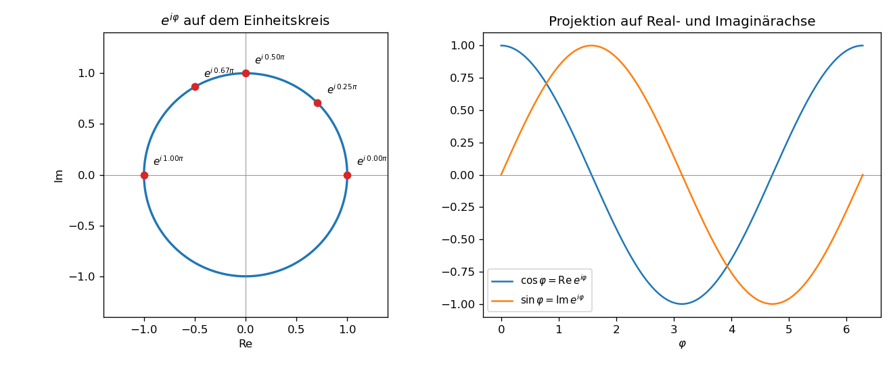

# Einheit 1: Komplexe Zahlen und Euler-Formel

## 1.1 Komplexe Zahlen

Eine komplexe Zahl hat die Form

$$
z = a + ib
$$

mit Realteil \(a\), Imaginärteil \(b\) und \(i^2 = -1\).

Man kann \(z\) als Punkt oder Vektor in der komplexen Ebene ansehen:

- \(a\): horizontale Achse,
- \(b\): vertikale Achse,
- \(|z| = \sqrt{a^2 + b^2}\): Abstand vom Ursprung,
- \(\arg(z)\): Winkel zur positiven reellen Achse.

## 1.2 Polarform

Jede komplexe Zahl ungleich null lässt sich schreiben als

$$
z = r(\cos \varphi + i\sin \varphi)
$$

mit

$$
r = |z|, \qquad \varphi = \arg(z).
$$

## 1.3 Euler-Formel

Die Euler-Formel lautet:

$$
e^{i\varphi} = \cos \varphi + i\sin \varphi.
$$

Damit wird die Polarform besonders einfach:

$$
z = r e^{i\varphi}.
$$

## 1.4 Herleitung über Taylor-Reihen

Streng genommen *definiert* man die komplexe Exponentialfunktion durch die Potenzreihe

$$
e^z := \sum_{k=0}^{\infty}\frac{z^k}{k!},\qquad z\in\mathbb C.
$$

Die Reihe konvergiert für jedes \(z\in\mathbb C\) absolut. Erst dadurch dürfen wir im Folgenden Real- und Imaginärteil aus der Summe herausziehen und die Reihe nach geraden und ungeraden Potenzen umsortieren. Die Euler-Formel ist dann eine Folgerung, kein eigenständiges Axiom.

Die Taylor-Reihen von Exponentialfunktion, Sinus und Kosinus sind:

$$
e^x = 1 + x + \frac{x^2}{2!} + \frac{x^3}{3!} + \cdots
$$

$$
\cos x = 1 - \frac{x^2}{2!} + \frac{x^4}{4!} - \cdots
$$

$$
\sin x = x - \frac{x^3}{3!} + \frac{x^5}{5!} - \cdots
$$

Setzt man \(x = i\varphi\), erhält man:

$$
e^{i\varphi}
= 1 + i\varphi + \frac{(i\varphi)^2}{2!}
+ \frac{(i\varphi)^3}{3!}
+ \frac{(i\varphi)^4}{4!}
+ \cdots
$$

Da \(i^2=-1\), \(i^3=-i\), \(i^4=1\), trennen sich reelle und imaginäre Terme:

$$
e^{i\varphi}
= \left(1 - \frac{\varphi^2}{2!} + \frac{\varphi^4}{4!} - \cdots \right)
+ i\left(\varphi - \frac{\varphi^3}{3!} + \frac{\varphi^5}{5!} - \cdots \right).
$$

Also:

$$
e^{i\varphi} = \cos \varphi + i\sin \varphi.
$$

## 1.5 Geometrische Bedeutung

Die Zahl \(e^{i\varphi}\) liegt auf dem Einheitskreis. Wenn \(\varphi\) wächst, rotiert der Punkt gegen den Uhrzeigersinn.

Multiplikation mit \(e^{i\alpha}\) bedeutet: Rotation um den Winkel \(\alpha\).

Beispiel:

$$
z = 2e^{i\pi/3}
$$

hat Betrag \(2\) und Winkel \(\pi/3 = 60^\circ\).

## 1.6 Nützliche Folgerungen

Aus der Euler-Formel folgen:

$$
\cos x = \frac{e^{ix}+e^{-ix}}{2}
$$

und

$$
\sin x = \frac{e^{ix}-e^{-ix}}{2i}.
$$

Diese beiden Gleichungen sind die Brücke zur Fourier-Analyse: Sinus und Kosinus werden durch komplexe Exponentialfunktionen ersetzt.

## 1.7 Visualisierung



Wenn \(\varphi\) gleichmäßig anwächst, läuft \(e^{i\varphi}\) auf dem Einheitskreis um. Die Projektion auf die Realachse ergibt \(\cos\varphi\), auf die Imaginärachse \(\sin\varphi\) — der Phasenversatz um \(\pi/2\) ist die geometrische Folge.

Kernidee in Python (vollständiges Skript: [`scripts/einheit-1.py`](scripts/einheit-1.py)):

```python
import numpy as np

phi = np.linspace(0, 2 * np.pi, 400)
z = np.exp(1j * phi)           # Einheitskreis
re_part = z.real               # cos phi
im_part = z.imag               # sin phi
```

## Übungen zu Einheit 1

1. Schreibe \(3(\cos(\pi/4)+i\sin(\pi/4))\) in der Form \(re^{i\varphi}\).
2. Berechne \(e^{i\pi}\).
3. Zeige mit der Euler-Formel, dass \(\cos(-x)=\cos x\) und \(\sin(-x)=-\sin x\).
4. Was bewirkt die Multiplikation einer komplexen Zahl mit \(e^{i\pi/2}\)? (Hinweis: \(e^{i\pi/2}=i\).)

Lösungen: [loesungen/einheit-1.md](loesungen/einheit-1.md)

---

[Zurück zum Index](README.md) · [Weiter: Einheit 2 — Fourier-Reihen](einheit-2.md)
