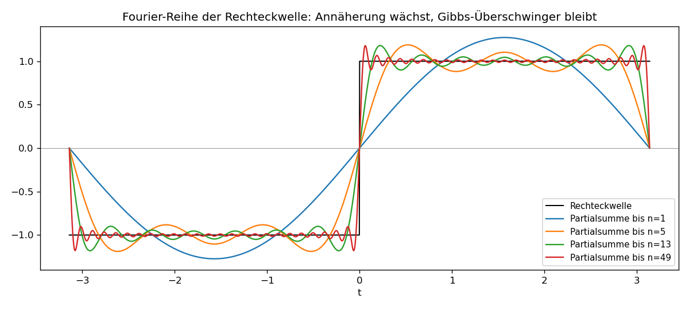

# Einheit 2: Fourier-Reihen

Welche Bausteine braucht man, um ein periodisches Signal vollständig zusammenzusetzen? Die Leitfrage dieser Einheit ist: Wie werden Schwingungen zu Koordinatenachsen, und wie liest man aus einem Signal die passenden Koordinaten ab? Fourier-Reihen beantworten genau das für periodische Signale.

## 2.1 Grundidee

Viele periodische Signale lassen sich als Summe einfacher Schwingungen schreiben. Statt Sinus und Kosinus verwendet man oft komplexe Exponentialfunktionen:

```math
e^{in\omega_0 t}
```

mit Grundkreisfrequenz

```math
\omega_0 = \frac{2\pi}{T}.
```

Hier ist $T$ die Periode und $n$ eine ganze Zahl.

## 2.2 Komplexe Fourier-Reihe

Für ein periodisches Signal $f(t)$ mit Periode $T$ gilt unter geeigneten Bedingungen:

```math
f(t) = \sum_{n=-\infty}^{\infty} c_n e^{in\omega_0 t}.
```

Die Koeffizienten sind:

```math
c_n = \frac{1}{T}\int_{t_0}^{t_0+T} f(t)e^{-in\omega_0 t}\,dt.
```

Die Zahl $c_n$ sagt:

- wie stark die Frequenz $n\omega_0$ vorkommt,
- mit welcher Phase sie vorkommt.

## 2.3 Warum funktioniert das?

Die Idee ist dieselbe wie in $\mathbb R^2$. Für einen Vektor $v$ und die Standardbasis $e_1=(1,0)$, $e_2=(0,1)$ sind die Koordinaten gerade Projektionen:
```math
v_1=\langle v,e_1\rangle,\qquad v_2=\langle v,e_2\rangle.
```
Dass $e_1$ und $e_2$ orthonormal sind, macht diese Projektionen eindeutig und einfach. Fourier-Analyse überträgt dieses Bild auf Funktionen: Die "Basisvektoren" sind jetzt Schwingungen.

Auf dem Raum der $T$-periodischen Funktionen definieren wir das Skalarprodukt

```math
\langle f,g\rangle := \frac{1}{T}\int_{0}^{T} f(t)\overline{g(t)}\,dt.
```

Beachte den **komplex konjugierten** zweiten Faktor — bei komplexen Funktionen ist das nötig, damit $\langle f,f\rangle=\frac{1}{T}\int_0^T|f(t)|^2\thinspace dt$ reell und nichtnegativ ist.

Die Funktionen $e_n(t)=e^{in\omega_0 t}$ sind bezüglich dieses Skalarprodukts orthonormal:

```math
\langle e_n,e_m\rangle
=\frac{1}{T}\int_{0}^{T} e^{in\omega_0 t}\,\overline{e^{im\omega_0 t}}\,dt
=\frac{1}{T}\int_{0}^{T} e^{i(n-m)\omega_0 t}\,dt
=
\begin{cases}
1, & n=m,\\ 0, & n\ne m.
\end{cases}
```

Das ist die direkte Verallgemeinerung rechtwinkliger Vektoren: Die Koeffizienten $c_n=\langle f,e_n\rangle$ sind die Projektionen des Signals auf die Frequenzrichtungen $e_n$.

Konvergenzfragen (punktweise, gleichmäßig oder im $L^2$-Sinne) lassen wir hier offen. Für glatte Signale konvergiert die Fourier-Reihe punktweise gegen das Signal; für stückweise stetige Signale gilt die Konvergenz im quadratischen Mittel. Die **Dirichlet-Bedingungen** sind ein hinreichendes Kriterium für punktweise Konvergenz: $f$ ist auf jedem Periodenintervall stückweise stetig, stückweise monoton und hat endlich viele Sprungstellen; an einer Sprungstelle konvergiert die Reihe gegen den Mittelwert $\tfrac12\bigl(f(t^-)+f(t^+)\bigr)$.

## 2.4 Beispiel: Reine Kosinusschwingung

Sei

```math
f(t) = \cos(\omega_0 t).
```

Mit Euler:

```math
\cos(\omega_0 t)
= \frac{e^{i\omega_0 t}+e^{-i\omega_0 t}}{2}.
```

Also sind nur zwei Koeffizienten ungleich null:

```math
c_1 = \frac12, \qquad c_{-1} = \frac12.
```

## 2.5 Beispiel: Reine Sinusschwingung

Sei

```math
f(t)=\sin(\omega_0 t).
```

Dann:

```math
\sin(\omega_0 t)
= \frac{e^{i\omega_0 t}-e^{-i\omega_0 t}}{2i}.
```

Also:

```math
c_1 = \frac{1}{2i} = -\frac{i}{2},
\qquad
c_{-1} = -\frac{1}{2i} = \frac{i}{2}.
```

## 2.6 Beispiel mit Integral: Rechteckwelle

Sei $f$ die $2\pi$-periodische Rechteckwelle mit $\omega_0=1$,

```math
f(t)=
\begin{cases}
+1, & 0<t<\pi,\\ -1, & -\pi<t<0.
\end{cases}
```

Wir rechnen $c_n$ für $n\ne 0$ direkt aus der Definition aus und nutzen, dass das Integral über jede Periode dasselbe ergibt:

```math
c_n
= \frac{1}{2\pi}\int_{-\pi}^{\pi} f(t)e^{-int}\,dt
= \frac{1}{2\pi}\left[\int_{0}^{\pi}e^{-int}\,dt-\int_{-\pi}^{0}e^{-int}\,dt\right].
```

Beide Integrale lassen sich elementar berechnen,

```math
\int_{0}^{\pi}e^{-int}\,dt = \frac{1-e^{-in\pi}}{in},\qquad
\int_{-\pi}^{0}e^{-int}\,dt = \frac{e^{in\pi}-1}{in}.
```

Mit $e^{\pm in\pi}=(-1)^n$ folgt

```math
c_n
= \frac{1}{2\pi}\cdot\frac{2\bigl(1-(-1)^n\bigr)}{in}
=
\begin{cases}
\dfrac{2}{i\pi n}=-\dfrac{2i}{\pi n}, & n \text{ ungerade},\\ 0, & n \text{ gerade}.
\end{cases}
```

Der Mittelwert ist $c_0=0$, weil das Signal symmetrisch um null pendelt. Setzt man die Beiträge für $\pm n$ (ungerade $n>0$) zusammen, erhält man mit $c_{-n}=\overline{c_n}$ und der Sinus-Formel aus Einheit 1:

```math
c_n e^{int}+c_{-n}e^{-int}
=-\frac{2i}{\pi n}\bigl(e^{int}-e^{-int}\bigr)
=\frac{4}{\pi n}\sin(nt).
```

Aufsummiert ergibt sich die berühmte Reihe

```math
f(t)=\frac{4}{\pi}\sum_{k=0}^{\infty}\frac{\sin\bigl((2k+1)t\bigr)}{2k+1}.
```

Genau diese Partialsummen werden in §2.8 grafisch verglichen — die Theorie hier liefert die Linien des Bildes.

## 2.7 Betrag und Phase

Ein Fourier-Koeffizient $c_n$ ist komplex.

- $|c_n|$ beschreibt die Stärke dieses zweiseitigen Frequenzanteils.
- $\arg(c_n)$ beschreibt die Phase.

Wichtig: Bei reellwertigen Signalen verteilt sich eine reale Sinus- oder Kosinusamplitude auf ein Paar positiver und negativer Frequenzen. Zum Beispiel hat

```math
\cos(\omega_0t)
= \frac12 e^{i\omega_0t}+\frac12 e^{-i\omega_0t}
```

die reelle Amplitude $1$, aber die zweiseitigen Koeffizienten $c_1=c_{-1}=1/2$. In einem einseitigen Amplitudenspektrum fasst man diese beiden Beiträge oft zusammen; dann taucht für $n>0$ ein Faktor $2$ auf.

Für reellwertige Signale gilt:

```math
c_{-n} = \overline{c_n}.
```

Das bedeutet: Positive und negative Frequenzen sind nicht unabhängig, wenn das Signal reell ist.

## 2.8 Visualisierung



Die Partialsummen aus immer mehr ungeraden Harmonischen nähern sich der in §2.6 hergeleiteten Reihe an. An den Sprungstellen bleibt das **Gibbs-Überschwingen** stehen — auch bei $N\to\infty$ verschwinden die Spitzen nicht ganz, ihre Breite schrumpft aber. Die senkrechte Markierung bei $t=0$ zeigt die Dirichlet-Aussage im Bild: Genau an der Sprungstelle liefert die Reihe den Mittelwert $\tfrac12(f(t^-)+f(t^+))=0$.

Kernidee in Python (vollständiges Skript: [`scripts/einheit-2.py`](scripts/einheit-2.py)):

```python
import numpy as np

t = np.linspace(-np.pi, np.pi, 2000)

def partial_sum(num_terms):
    result = np.zeros_like(t)
    for k in range(num_terms):
        n = 2 * k + 1
        result += np.sin(n * t) / n
    return (4 / np.pi) * result
```

## Übungen zu Einheit 2

1. Bestimme die komplexen Fourier-Koeffizienten von $f(t)=2\cos(3\omega_0t)$.
2. Bestimme die komplexen Fourier-Koeffizienten von $f(t)=4\sin(2\omega_0t)$.
3. Warum treten bei reellen Signalen positive und negative Frequenzen paarweise auf?
4. Erkläre den Unterschied zwischen Grundfrequenz und Oberwelle.
5. Konstruiere eine $2\pi$-periodische Funktion, deren Fourier-Reihe nur Sinus-Terme enthält. Wovon hängt diese Eigenschaft ab?
6. Fehlerdiagnose: Jemand behauptet, ein reelles Signal könne nur den Koeffizienten $c_3=2$ haben und alle anderen $c_n=0$. Kann das stimmen? Falls nicht: Wie muss mindestens ergänzt werden?

## Selbstcheck zu Einheit 2

- [ ] Ich kann erklären, warum Fourier-Koeffizienten Projektionen sind.
- [ ] Ich kann $c_n$ für reine Sinus- und Kosinusschwingungen bestimmen.
- [ ] Ich kann den Unterschied zwischen reeller Amplitude und zweiseitigen Koeffizienten benennen.
- [ ] Ich kann sagen, was die Reihe an einer Sprungstelle liefert.
- [ ] Ich kann Symmetrien eines Signals mit fehlenden Sinus- oder Kosinus-Termen verbinden.
- [ ] Ich kann an Koeffizienten erkennen, ob ein Signal reellwertig sein kann.

Lösungen: [loesungen/einheit-2.md](loesungen/einheit-2.md)

---

[Zurück: Einheit 1 — Euler-Formel](einheit-1.md) · [Index](README.md) · [Weiter: Einheit 3 — Fourier-Transformation](einheit-3.md)
