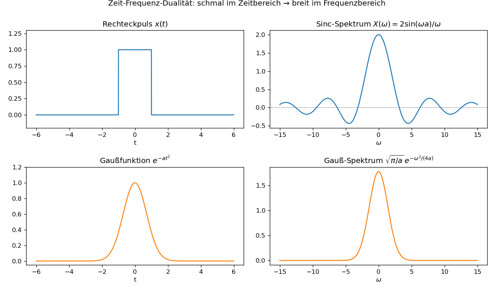

# Einheit 3: Fourier-Transformation

Was bleibt von Fourier übrig, wenn ein Signal nicht periodisch ist und daher keine einzelne Grundfrequenz hat? Diese Einheit ersetzt die diskreten Linien der Fourier-Reihe durch ein kontinuierliches Spektrum. Damit werden Pulse, Fenster, Gaußfunktionen und reale Messsignale zugänglich.

## 3.1 Von Fourier-Reihe zur Fourier-Transformation

Fourier-Reihen beschreiben periodische Signale. Viele reale Signale sind aber nicht periodisch: ein Puls, ein Messfenster, ein Ton mit Anfang und Ende.

Die Fourier-Transformation ersetzt die diskreten Frequenzen \(n\omega_0\) durch ein kontinuierliches Spektrum \(\omega\).

## 3.2 Definition

Wir verwenden die Konvention aus der [Kurs-Übersicht](README.md#konventionen-und-voraussetzungen): \(\omega\) ist die Kreisfrequenz in rad/s. Wenn später numerische Beispiele in Hertz auftreten, gilt immer \(\omega=2\pi f\).

$$
X(\omega) = \mathcal{F}\{x(t)\}
= \int_{-\infty}^{\infty} x(t)e^{-i\omega t}\,dt.
$$

Die Rücktransformation lautet:

$$
x(t)
= \mathcal{F}^{-1}\{X(\omega)\}
= \frac{1}{2\pi}\int_{-\infty}^{\infty} X(\omega)e^{i\omega t}\,d\omega.
$$

Das Integral konvergiert als gewöhnliches Lebesgue-Integral für \(x\in L^1(\mathbb R)\). Für \(x\in L^2(\mathbb R)\) erklärt man \(\mathcal F\) über einen Grenzprozess (Satz von Plancherel); für \(\delta\), \(\sin\) und \(\cos\) interpretiert man die Aussagen distributionentheoretisch. Vergleiche auch die Konventionshinweise in der [Kurs-Übersicht](README.md#konventionen-und-voraussetzungen).

## 3.3 Interpretation

Die Fourier-Transformation fragt für jede Kreisfrequenz \(\omega\):

> Wie stark ähnelt \(x(t)\) der Schwingung \(e^{i\omega t}\)?

Dabei liefert:

- \(|X(\omega)|\): Amplitudeninformation,
- \(\arg X(\omega)\): Phaseninformation.

## 3.4 Beispiel: Dirac-Impuls

Der Dirac-Impuls \(\delta(t)\) ist keine gewöhnliche Funktion, sondern eine idealisierte Distribution. Man verwendet ihn über seine Siebeigenschaft:

$$
\int_{-\infty}^{\infty} f(t)\delta(t-t_0)\,dt=f(t_0).
$$

Alle folgenden Aussagen über \(\delta\) sind in diesem Sinn zu verstehen.

Für den Dirac-Impuls \(\delta(t)\) gilt:

$$
\mathcal{F}\{\delta(t)\}
=\int_{-\infty}^{\infty}\delta(t)e^{-i\omega t}\,dt
=e^{-i\omega\cdot 0}
=1.
$$

Ein unendlich kurzer Impuls enthält alle Frequenzen gleich stark.

## 3.5 Beispiel: Verschobener Impuls

Für \(\delta(t-t_0)\) gilt:

$$
\mathcal{F}\{\delta(t-t_0)\}
=\int_{-\infty}^{\infty}\delta(t-t_0)e^{-i\omega t}\,dt
=e^{-i\omega t_0}.
$$

Eine Zeitverschiebung erzeugt also eine frequenzabhängige Phase.

## 3.6 Beispiel: Rechteckpuls

Sei

$$
x(t)=
\begin{cases}
1, & |t|\le a,\\
0, & |t|>a.
\end{cases}
$$

Dann:

$$
X(\omega)
= \int_{-a}^{a} e^{-i\omega t}\,dt
= \frac{2\sin(\omega a)}{\omega}
= 2a\,\operatorname{sinc}\!\left(\frac{\omega a}{\pi}\right).
$$

Dabei ist \(\operatorname{sinc}(x)=\sin(\pi x)/(\pi x)\) die **normierte Sinc-Funktion** (manche Autoren verwenden die unnormierte Variante \(\sin(x)/x\); beim Lesen also auf die Konvention achten). Sie hat ihre erste Nullstelle bei \(x=1\) und gleicht über den ganzen Kurs als Spektralform jedes Rechteckpulses.

Für \(\omega=0\) nimmt man den Grenzwert:

$$
X(0)=2a.
$$

Ein breiter Puls im Zeitbereich hat ein schmales Spektrum; ein schmaler Puls hat ein breites Spektrum. Quantitativ ist das eine Form der **Unschärferelation**: Zeit- und Frequenzkonzentration sind nicht gleichzeitig beliebig klein.

## 3.7 Beispiel: Gaußfunktion

Für

$$
x(t)=e^{-at^2}, \qquad a>0
$$

ist auch die Fourier-Transformierte eine Gaußfunktion:

$$
X(\omega)=\sqrt{\frac{\pi}{a}}e^{-\omega^2/(4a)}.
$$

Beweisidee: Im Integranden \(e^{-at^2}e^{-i\omega t}\) lässt sich der Exponent durch **quadratische Ergänzung** umformen zu \(-a(t+\tfrac{i\omega}{2a})^2-\tfrac{\omega^2}{4a}\). Der \(\omega\)-abhängige Teil zieht aus dem Integral heraus, und der verbleibende Gauß-Anteil liefert mit einem Konturargument den Faktor \(\sqrt{\pi/a}\).

Die Gaußfunktion ist deshalb in Wahrscheinlichkeitstheorie, Quantenmechanik und Signalverarbeitung besonders wichtig: Sie ist (bis auf Skalierung) ihre eigene Fourier-Transformierte und minimiert die Zeit-Frequenz-Unschärfe.

## 3.8 Visualisierung



Oben: Ein scharf begrenzter Rechteckpuls hat ein langsam abklingendes, oszillierendes Sinc-Spektrum. Unten: Eine Gaußfunktion hat eine Gauß-Transformierte; ihre Form bleibt erhalten, nur die Skalen kehren sich um. Die absoluten Höhen der vier Panels sind nicht normiert (Sinc-Maximum \(2a=2\), Gauß-Spektrum-Maximum \(\sqrt{\pi/a}\approx 1{,}77\)); der Vergleich gilt also Formen und Breiten, nicht Amplituden.

Die Darstellung lohnt sich nicht nur als Bestätigung der Formeln. Sie macht eine Eigenschaft sichtbar, die in der Rechnung leicht untergeht: harte Kanten im Zeitbereich erzeugen lange spektrale Ausläufer, glatte Konzentration erzeugt glatte Konzentration im Spektrum.

Kernidee in Python (vollständiges Skript: [`scripts/einheit-3.py`](scripts/einheit-3.py)):

```python
import numpy as np

t = np.linspace(-6, 6, 2000)
omega = np.linspace(-15, 15, 2000)

rect = np.where(np.abs(t) <= 1.0, 1.0, 0.0)
rect_ft = 2 * np.sinc(omega / np.pi)   # = 2 sin(omega)/omega, sauber bei omega=0

gauss = np.exp(-t**2)
gauss_ft = np.sqrt(np.pi) * np.exp(-omega**2 / 4)
```

## Übungen zu Einheit 3

1. Was ist der Unterschied zwischen Fourier-Reihe und Fourier-Transformation?
2. Berechne \(\mathcal{F}\{\delta(t-3)\}\).
3. Was passiert mit dem Spektrum eines Rechteckpulses, wenn der Puls im Zeitbereich breiter wird?
4. Warum enthält ein sehr kurzer Impuls viele Frequenzen?
5. Skizziere ohne Integralrechnung qualitativ das Spektrum von \(x(t)=\cos(\omega_0t)\cdot \operatorname{rect}(t/T)\). Nutze die Idee, dass ein zeitlich begrenzter Kosinus ein Rechteckspektrum um \(\pm\omega_0\) verschiebt. Prüfe deine Begründung nach [§4.3](einheit-4.md#43-frequenzverschiebung) erneut.
6. Fehlerdiagnose: Jemand schreibt \(\delta(0)=\infty\) und versucht damit \(\mathcal F\{\delta\}\) wie ein gewöhnliches Integral auszurechnen. Warum ist das keine saubere Begründung? Welche Eigenschaft verwendet man stattdessen?

## Selbstcheck zu Einheit 3

- [ ] Ich kann erklären, warum aus Frequenzlinien ein kontinuierliches Spektrum wird.
- [ ] Ich kann die Fourier-Transformierte eines verschobenen Dirac-Impulses bestimmen.
- [ ] Ich kann Rechteckpuls und Sinc-Spektrum als Zeit-Frequenz-Dualität lesen.
- [ ] Ich kann qualitativ vorhersagen, wie Breite im Zeitbereich und Breite im Frequenzbereich zusammenhängen.
- [ ] Ich kann aus einer Visualisierung eine Spektrumeigenschaft formulieren, nicht nur die Formel wiederholen.
- [ ] Ich kann den Dirac-Impuls als Distribution über seine Siebeigenschaft statt als gewöhnliche Funktion verwenden.

Lösungen: [loesungen/einheit-3.md](loesungen/einheit-3.md)

---

[Zurück: Einheit 2 — Fourier-Reihen](einheit-2.md) · [Index](README.md) · [Weiter: Einheit 4 — Eigenschaften](einheit-4.md)
