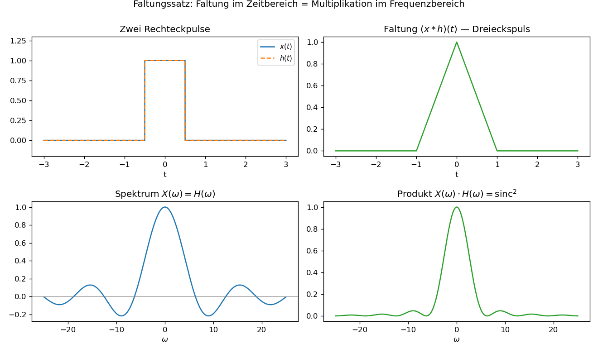

# Einheit 4: Eigenschaften der Fourier-Transformation

Die folgenden Eigenschaften sind oft wichtiger als einzelne Integrale.

## 4.1 Linearität

Wenn

$$
x(t) \leftrightarrow X(\omega), \qquad y(t)\leftrightarrow Y(\omega),
$$

dann gilt:

$$
ax(t)+by(t) \leftrightarrow aX(\omega)+bY(\omega).
$$

## 4.2 Zeitverschiebung

$$
x(t-t_0) \leftrightarrow e^{-i\omega t_0}X(\omega).
$$

Eine Verschiebung im Zeitbereich ändert die Phase im Frequenzbereich.

**Beweis (musterhaft, weil derselbe Trick überall wiederkehrt):** Substitution \(u=t-t_0\) im Definitionsintegral liefert
$$
\int_{-\infty}^{\infty} x(t-t_0)e^{-i\omega t}\,dt
= \int_{-\infty}^{\infty} x(u)e^{-i\omega(u+t_0)}\,du
= e^{-i\omega t_0}\int_{-\infty}^{\infty} x(u)e^{-i\omega u}\,du
= e^{-i\omega t_0}X(\omega).
$$
Die übrigen Eigenschaften in diesem Kapitel folgen mit analogen Substitutionen oder partieller Integration.

## 4.3 Frequenzverschiebung

$$
e^{i\omega_0t}x(t) \leftrightarrow X(\omega-\omega_0).
$$

Multiplikation mit einer komplexen Schwingung verschiebt das Spektrum.

## 4.4 Skalierung

Für \(a\ne0\):

$$
x(at) \leftrightarrow \frac{1}{|a|}X\left(\frac{\omega}{a}\right).
$$

Zeitliche Stauchung führt zu spektraler Streckung.

## 4.5 Ableitung

Unter der Voraussetzung, dass \(x\) und \(x'\) integrierbar sind und \(x(t)\to0\) für \(|t|\to\infty\), gilt:

$$
\frac{d}{dt}x(t) \leftrightarrow i\omega X(\omega).
$$

Beweis durch partielle Integration; die Randterme verschwinden gerade wegen \(x(t)\to0\). Die Regel zeigt: Ableiten verstärkt hohe Frequenzen, weil der Faktor \(i\omega\) für große \(|\omega|\) groß wird.

## 4.6 Faltung

Die Faltung zweier Funktionen ist:

$$
(x*h)(t)=\int_{-\infty}^{\infty}x(\tau)h(t-\tau)\,d\tau.
$$

Im Frequenzbereich gilt:

$$
x*h \leftrightarrow X(\omega)H(\omega).
$$

Faltung im Zeitbereich wird Multiplikation im Frequenzbereich.

Umgekehrt gilt:

$$
x(t)h(t) \leftrightarrow \frac{1}{2\pi}(X*H)(\omega).
$$

## 4.7 Parseval-Identität (Plancherel)

Für \(x\in L^2(\mathbb R)\) gilt:

$$
\int_{-\infty}^{\infty}|x(t)|^2\,dt
=
\frac{1}{2\pi}\int_{-\infty}^{\infty}|X(\omega)|^2\,d\omega.
$$

Die Energie eines Signals kann im Zeit- oder Frequenzbereich gemessen werden. Allgemeiner gilt das innere Produkt: \(\langle x,y\rangle_t = \tfrac{1}{2\pi}\langle X,Y\rangle_\omega\); die Fourier-Transformation ist also (bis auf den Faktor \(2\pi\)) eine Isometrie auf \(L^2\).

## 4.8 Visualisierung



Zwei identische Rechteckpulse werden gefaltet — heraus kommt der klassische Dreieckspuls. Im Frequenzbereich entspricht das einfach der punktweisen Multiplikation der beiden Sinc-Spektren, die das bekannte \(\operatorname{sinc}^2\)-Profil ergibt (nichtnegativ, weil Quadrat).

Kernidee in Python (vollständiges Skript: [`scripts/einheit-4.py`](scripts/einheit-4.py)):

```python
import numpy as np

t = np.linspace(-3, 3, 4000)
dt = t[1] - t[0]

rect = np.where(np.abs(t) <= 0.5, 1.0, 0.0)
triangle = np.convolve(rect, rect, mode="same") * dt   # = (rect * rect)(t)
```

## Übungen zu Einheit 4

1. Was passiert im Frequenzbereich, wenn ein Signal zeitlich verschoben wird?
2. Warum verstärkt Ableiten hohe Frequenzen?
3. Was ist der Vorteil des Faltungssatzes?
4. Ein Filter hat Spektrum \(H(\omega)\). Was ist das Spektrum des gefilterten Signals \(y=x*h\)?

Lösungen: [loesungen/einheit-4.md](loesungen/einheit-4.md)

---

[Zurück: Einheit 3 — Fourier-Transformation](einheit-3.md) · [Index](README.md) · [Weiter: Einheit 5 — DFT und FFT](einheit-5.md)
