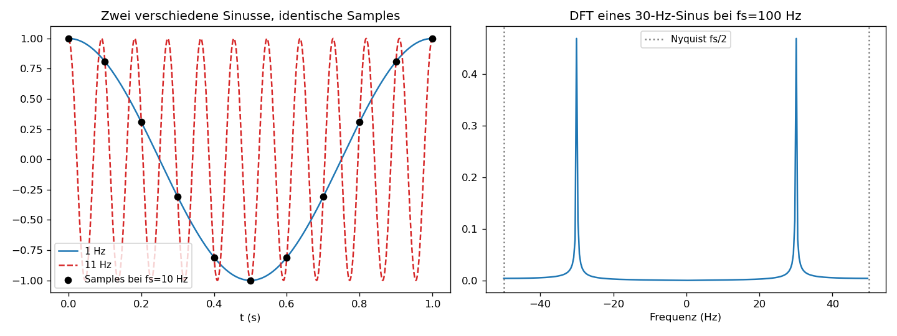

# Einheit 5: Diskrete Signale, DFT und FFT

> **Hauptschwelle dieser Einheit.** *Frequenzauflösung* ($\Delta f$) und *gezeichnete Frequenzauflösung* (Bin-Dichte) sind **zwei verschiedene Größen**. Die echte Auflösung hängt allein an der Messdauer $T_{\text{mess}}$; Zero Padding macht das Bild glatter, ohne neue Information hinzuzufügen. Zugleich begrenzt die Nyquist-Frequenz, welche Schwingungen aus den Samples *überhaupt* rekonstruierbar sind. Wer beides nicht trennt, interpretiert FFT-Plots regelmäßig falsch.

Computer können kein Integral über unendlich viele Zeiten auswerten; sie speichern endlich viele Zahlen. Die Leitfrage dieser Einheit lautet: Was bedeutet "Fourier", wenn nur $N$ Abtastwerte vorliegen? Die Antwort führt zur DFT, zur FFT und zur unvermeidlichen Nyquist-Grenze.

## 5.1 Warum diskret?

Computer speichern endlich viele Messwerte:

```math
x[0], x[1], \ldots, x[N-1].
```

Die diskrete Fourier-Transformation (DFT) zerlegt diese Werte in diskrete Frequenzanteile.

## 5.2 Definition der DFT

Die DFT ist:

```math
X[k] = \sum_{n=0}^{N-1} x[n]e^{-i2\pi kn/N},
\qquad k=0,\ldots,N-1.
```

Die inverse DFT ist:

```math
x[n] = \frac{1}{N}\sum_{k=0}^{N-1}X[k]e^{i2\pi kn/N}.
```

**Periodizität.** Aus den Definitionen folgt direkt
$$X[k+N]=X[k],\qquad x[n+N]=x[n].$$
DFT und Eingangsfolge sind also implizit $N$-periodisch fortgesetzt. Das erklärt, warum es nur $N$ verschiedene Frequenzbins gibt — und es ist auch der Grund, weshalb Aliasing in der DFT überhaupt auftritt.

**Normierungskonvention.** Wir wählen den Faktor $1/N$ bei der **inversen** Transformation. Das ist die Konvention von NumPy (`numpy.fft.fft`/`ifft`), SciPy und MATLAB. Andere Quellen verwenden $1/\sqrt N$ auf beiden Seiten (symmetrische Variante) oder $1/N$ vorne; die Sätze sind dieselben, die Zahlenwerte einzelner Koeffizienten unterscheiden sich um einen Vorfaktor.

## 5.3 Interpretation der Frequenzindizes

Wenn die Abtastrate $f_s$ ist, gehört zum Index $k$ die Frequenz

```math
f_k = \frac{k}{N}f_s.
```

Diese Formel beschreibt zunächst die unsortierte DFT-Bin-Position. Für die physikalische Interpretation verwendet man meist die signierte Frequenz:

```math
f_k = \begin{cases} \frac{k}{N}f_s, & 0\le k < \left\lceil\frac{N}{2}\right\rceil,\\ \frac{k-N}{N}f_s, & \left\lceil\frac{N}{2}\right\rceil\le k < N. \end{cases}
```

Für ungerades $N$ ist die Aufteilung in positive ($k < N/2$) und negative ($k > N/2$) Frequenzen eindeutig. Für gerades $N$ ist der **Nyquist-Bin** $k=N/2$ ein Sonderfall: positive und negative Frequenz $\pm f_s/2$ fallen dort algebraisch zusammen, weil sich die Abtastwerte einer Schwingung mit $f=f_s/2$ nur im Vorzeichen unterscheiden. NumPys `fft.fftfreq` ordnet diesen Bin der negativen Frequenz $-f_s/2$ zu (also der zweite Fall oben mit $k=N/2$); inhaltlich macht das keinen Unterschied, weil das Bild dort symmetrisch ist.

**Symmetrie reeller Signale.** Ist $x[n]$ reell, so gilt
```math
X[N-k]=\overline{X[k]},\qquad k=1,\ldots,N-1.
```
Insbesondere ist $|X[N-k]|=|X[k]|$ und $\arg X[N-k]=-\arg X[k]$. Positive und negative Frequenzanteile tragen also redundante Information. In der Praxis genügt es daher, die Bins $k=0,\ldots,\lfloor N/2\rfloor$ anzuzeigen (einseitiges Spektrum). Das ist auch der Grund, warum NumPys `rfft` nur diese Hälfte zurückgibt.

## 5.4 FFT

Die FFT ist kein anderes mathematisches Objekt als die DFT. Sie ist ein schneller Algorithmus zur Berechnung der DFT.

- Direkte DFT: ungefähr $N^2$ Operationen.
- FFT: ungefähr $N\log_2 N$ Operationen.

## 5.5 Frequenzauflösung, Leckage und Fensterung

Die DFT sieht nur $N$ Samples über eine endliche Messdauer
```math
T_{\text{mess}}=\frac{N}{f_s}.
```
Dadurch liegen die Frequenzbins im Abstand
```math
\Delta f=\frac{f_s}{N}=\frac{1}{T_{\text{mess}}}.
```

Eine Sinusschwingung fällt genau auf einen DFT-Bin, wenn
```math
f_0=m\Delta f
```
für eine ganze Zahl $m$ gilt. Dann enthält das Messfenster eine ganze Zahl von Perioden; man nennt die Abtastung **kohärent**. Fällt $f_0$ zwischen zwei Bins, verteilt sich die Energie auf viele Bins. Das ist **Spektralleckage**.

Der Grund ist nicht, dass die FFT ungenau wäre. Die DFT behandelt die $N$ Samples als eine Periode einer periodischen Fortsetzung. Wenn Anfang und Ende des Messfensters nicht zusammenpassen, entsteht in dieser periodischen Fortsetzung ein Sprung. Sprünge erzeugen breite Spektralanteile.

Eine **Fensterfunktion** (z. B. Hann- oder Hamming-Fenster) dämpft die Ränder des Messfensters und verringert Nebenkeulen. Der Preis ist ein breiteres Hauptmaximum und veränderte Amplitudenskalen. Fensterung verbessert also die Lesbarkeit des Spektrums, aber sie zaubert keine zusätzliche Information in die Daten.

Auch **Zero Padding** muss man richtig einordnen: Wenn man Nullen anhängt, bekommt man mehr gezeichnete Frequenzpunkte zwischen den ursprünglichen Bins. Das Spektrum wirkt glatter, aber die physikalische Auflösung bleibt durch die ursprüngliche Messdauer bestimmt.

## 5.6 Abtastung und Nyquist-Grenze

Wenn ein kontinuierliches Signal mit Abtastrate $f_s$ abgetastet wird, können Frequenzen mit $|f| < f_s/2$ ohne Aliasing eindeutig dargestellt werden. Die Grenze

```math
f_N=\frac{f_s}{2}
```

heißt Nyquist-Frequenz.

Der exakte Randfall $f=f_s/2$ ist ein Sonderfall: positive und negative Frequenz fallen dort auf denselben Abtastwertwechsel von Sample zu Sample. In der DFT ist das bei geradem $N$ der Nyquist-Bin $k=N/2$, der keine separate positive/negative Gegenfrequenz hat. Praktisch hält man Nutzsignale deshalb unterhalb der Nyquist-Frequenz und verwendet vor der Abtastung ein Anti-Aliasing-Filter.

Frequenzen oberhalb dieser Grenze erscheinen als falsche niedrigere Frequenzen. Das nennt man Aliasing.

## 5.7 Visualisierung



Links: Eine 1-Hz-Schwingung und eine 11-Hz-Schwingung erzeugen bei $f_s=10\thinspace \text{Hz}$ **exakt dieselben Abtastwerte** — die roten Kreise umschließen die schwarzen Punkte. Aus den Samples allein lassen sich die beiden Frequenzen nicht unterscheiden, das ist Aliasing. In der Mitte zeigt die DFT eines 30-Hz-Kosinus bei $f_s=100\thinspace \text{Hz}$ zwei symmetrische Linien bei $\pm 30\thinspace \text{Hz}$ (konjugierte Symmetrie reeller Signale). Rechts sieht man dieselbe Aliasing-Idee im Spektrum: Linien außerhalb des Nyquist-Bands werden in das Band $[-f_s/2,f_s/2)$ zurückgefaltet.

Kernidee in Python (vollständiges Skript: [`scripts/einheit-5.py`](scripts/einheit-5.py)):

```python
import numpy as np

fs = 100.0
N = 500
n = np.arange(N)
signal = np.cos(2 * np.pi * 30.0 * n / fs)

X = np.fft.fft(signal)
freqs = np.fft.fftfreq(N, d=1 / fs)        # signierte Frequenzachse
```

## Übungen zu Einheit 5

1. Was ist der Unterschied zwischen DFT und FFT?
2. Ein Signal wird mit $f_s=1000\thinspace \text{Hz}$ abgetastet. Was ist die Nyquist-Frequenz, und welcher Frequenzbereich ist ohne Aliasing eindeutig?
3. Warum ist Aliasing problematisch?
4. Was bedeutet der DFT-Koeffizient $X[0]$?
5. Du tastest $\cos(2\pi\cdot 7\thinspace \text{Hz}\cdot t)$ mit $f_s=10\thinspace \text{Hz}$ ab. Welche scheinbare Frequenz misst die DFT im Nyquist-Band?
6. Eine Messung verwendet $f_s=1000\thinspace \text{Hz}$ und $N=250$. Wie groß ist die Bin-Breite $\Delta f$? Fällt ein $77\thinspace \text{Hz}$-Sinus auf einen DFT-Bin?
7. Fehlerdiagnose: Jemand sagt: "Ich nutze Zero Padding, deshalb steigt die echte Frequenzauflösung meiner Messung." Was ist daran falsch?
8. Warum kann ein Fenster Spektralleckage reduzieren, obwohl es das Signal im Zeitbereich verändert?
9. Code-Werkstatt *(Vertiefung, ca. 30 Minuten)*: Generiere ein $77\thinspace\text{Hz}$-Kosinussignal mit $f_s=1000\thinspace\text{Hz}$ und $N=250$ Samples. Berechne (a) die DFT ohne Fenster, (b) die DFT mit Hann-Fenster, und (c) die DFT mit angehängten $750$ Nullen (Zero Padding). Zeichne alle drei Betragsspektren auf dem signierten Frequenzgitter aus `numpy.fft.fftfreq` und interpretiere konkret: Wo ist die Spektrallinie? Wie breit ist sie? Wie verändern Fenster und Zero Padding das Bild? Ein Codegerüst:
   ```python
   import numpy as np
   fs, N = 1000.0, 250
   n = np.arange(N)
   x = np.cos(2 * np.pi * 77.0 * n / fs)
   X_rect = np.fft.fft(x)
   X_hann = np.fft.fft(x * np.hanning(N))
   X_zpad = np.fft.fft(np.concatenate([x, np.zeros(750)]))

   # Selbsttest: Bin-Breite ohne und mit Zero Padding
   assert abs(np.fft.fftfreq(N, d=1 / fs)[1] - 4.0) < 1e-9         # Δf = 4 Hz
   assert abs(np.fft.fftfreq(N + 750, d=1 / fs)[1] - 1.0) < 1e-9   # Δf = 1 Hz
   # Selbsttest: 77 Hz fällt zwischen den 4-Hz-Bins (Leckage ist zu erwarten)
   assert abs((77.0 / 4.0) - round(77.0 / 4.0)) > 0.1
   ```
10. Konstruktion: Konstruiere ein reelles Signal $x[n]$ mit $N=64$ und $f_s=64\thinspace\text{Hz}$, das bei der DFT **genau zwei** nichtverschwindende Bins erzeugt (außer dem konjugierten Spiegelbild). Welche Frequenzen erfüllen die Kohärenz-Bedingung $f_0=m\Delta f$? Gib eine konkrete Wahl an, die in einem Frequenzbereich zwischen $5$ und $15\thinspace\text{Hz}$ liegt.

## Selbstcheck zu Einheit 5

- [ ] Ich kann die DFT-Definition von der FFT als Algorithmus unterscheiden.
- [ ] Ich kann DFT-Bins in physikalische Frequenzen umrechnen.
- [ ] Ich kann Bin-Breite, Messdauer und kohärente Abtastung verbinden.
- [ ] Ich kann Spektralleckage als Folge eines endlichen, nicht periodisch passenden Messfensters erklären.
- [ ] Ich kann sagen, was Fensterung und Zero Padding leisten und was nicht.
- [ ] Ich kann den Nyquist-Bereich für eine gegebene Abtastrate bestimmen.
- [ ] Ich kann Aliasing an einem konkreten Zahlenbeispiel berechnen.
- [ ] Ich kann $X[0]$ als Gleichanteil/Mittelwertinformation deuten.

Lösungen: [loesungen/einheit-5.md](loesungen/einheit-5.md)

---

[Zurück: Einheit 4b — Faltung, Energie, Symmetrien](einheit-4b.md) · [Index](README.md) · [Weiter: Einheit 6 — Hilbert-Transformation](einheit-6.md)
