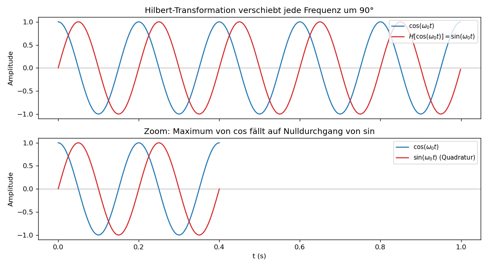

# Einheit 6: Hilbert-Transformation

> **Hauptschwelle dieser Einheit.** Die Hilbert-Transformation ist im Frequenzbereich *einfach* — Multiplikation mit $-i\thinspace\mathrm{sgn}(\omega)$ — und im Zeitbereich *kompliziert* — eine Faltung mit dem singulären Kern $1/(\pi t)$, die ein Hauptwertintegral verlangt. Beide Beschreibungen meinen denselben LTI-Operator. Wer das verinnerlicht hat, akzeptiert, dass eine "einfache" Operation im einen Bereich im anderen aufwendig sein darf — das ist der Hauptnutzen der Frequenzbereichsdarstellung.

Wir suchen einen Operator, der jede Schwingung um $90^\circ$ in die Quadratur verschiebt, ohne ihre Amplitude zu verändern. Dass dieser Operator im Frequenzbereich fast nur ein Vorzeichenfilter ist, ist die zentrale Überraschung. Die Zeitbereichsform mit Hauptwertintegral kommt danach als dieselbe Idee in der Sprache der Faltung.

## 6.1 Grundidee

Die Hilbert-Transformation erzeugt aus einem Signal ein neues Signal, dessen Frequenzanteile um $90^\circ$ phasenverschoben sind:

- positive Frequenzen werden um $-90^\circ$ verschoben,
- negative Frequenzen werden um $+90^\circ$ verschoben.

Sie ist besonders wichtig für:

- analytische Signale,
- Hüllkurven,
- Phasenanalyse,
- Modulation,
- Kausalitätsbeziehungen in Physik und Systemtheorie.

## 6.2 Definition im Frequenzbereich

Am klarsten ist die Hilbert-Transformation im Frequenzbereich. Für ein Signal $x(t)\leftrightarrow X(\omega)$ definieren wir:

```math
\mathcal{F}\{\mathcal{H}x\}(\omega)
=
-i\,\mathrm{sgn}(\omega)X(\omega).
```

Dabei ist

```math
\mathrm{sgn}(\omega)= \begin{cases} 1, & \omega>0,\\ 0, & \omega=0,\\ -1, & \omega<0. \end{cases}
```

Positive Frequenzen werden mit $-i$ multipliziert, also um $-90^\circ$ gedreht. Negative Frequenzen werden mit $+i$ multipliziert, also um $+90^\circ$ gedreht. Der Gleichanteil bei $\omega=0$ wird auf null gesetzt.

## 6.3 Definition im Zeitbereich

Die Zeitbereichsform wirkt auf den ersten Blick fremder, beschreibt aber denselben Operator. Für ein geeignetes Signal $x(t)$ ist die Hilbert-Transformierte:

```math
\mathcal{H}\{x\}(t)
=
\frac{1}{\pi}\,\text{p.v.}\int_{-\infty}^{\infty}
\frac{x(\tau)}{t-\tau}\,d\tau.
```

"p.v." steht für Cauchy-Hauptwert. Das ist nötig, weil der Integrand bei $\tau=t$ singulär ist.

Strukturell ist das eine **Faltung** mit dem Kern $h(t)=1/(\pi t)$:
```math
\mathcal H\{x\} = h * x,\qquad h(t)=\frac{1}{\pi t}.
```
Die Hilbert-Transformation ist also ein linearer, zeitinvarianter (LTI-)Operator und passt in den Rahmen von [Einheit 4b](einheit-4b.md): Ihr Frequenzgang ist
```math
\mathcal F\{1/(\pi t)\}(\omega)=-i\,\mathrm{sgn}(\omega)
```
im distributionellen Sinn. Nach dem Faltungssatz aus [§4b.1](einheit-4b.md#4b1-faltung) wird Faltung mit $1/(\pi t)$ daher zur Multiplikation mit $-i\thinspace \mathrm{sgn}(\omega)$. §6.2 und §6.3 sind also dieselbe Transformation in zwei Sprachen.

## 6.4 Beispiele

Für $\omega_0>0$ gilt:

```math
\mathcal{H}\{\cos(\omega_0t)\} = \sin(\omega_0t).
```

und

```math
\mathcal{H}\{\sin(\omega_0t)\} = -\cos(\omega_0t).
```

Die Hilbert-Transformation entspricht also einer Quadratur-Komponente.

Ein klassisches nichttriviales Paar ist

```math
\mathcal{H}\!\left\{\frac{1}{1+t^2}\right\}(t)=\frac{t}{1+t^2}.
```

**Strukturaussage.** Die Hilbert-Transformation überführt diese *gerade* Funktion in eine *ungerade* — ein Spezialfall einer allgemeinen Regel: Auf reellen Signalen vertauscht $\mathcal H$ die Parität (vgl. Übung 5 und die Symmetrie­tabelle in [§4b.3](einheit-4b.md#4b3-symmetrien-reeller-und-geraderungerader-signale)). Diese Strukturaussage ist das Wesentliche für den weiteren Kurs; der explizite Nachweis steht im Vertiefungs-Block unten und kann beim ersten Durchgang übersprungen werden.

<details>
<summary><strong>Vertiefung — expliziter Nachweis im Frequenzbereich (optional).</strong></summary>

Die Fourier-Transformierte ist
$$\mathcal F\lbrace 1/(1+t^2)\rbrace(\omega)=\pi e^{-|\omega|}.$$
Dieses Paar verwenden wir hier als bekannt — sein elementarer Beweis nutzt entweder Konturintegration (Residuensatz, Pol bei $t=i$) oder eine DGL-Idee analog zu [§3.7](einheit-3.md#37-beispiel-gaußfunktion); beide Wege liegen außerhalb des Kurses. Es ist ein klassisches Tabellenpaar (z. B. Bracewell, Oppenheim/Willsky). Multiplikation mit $-i\thinspace\mathrm{sgn}(\omega)$ und Rücktransformation liefern
```math
\frac{1}{2\pi}\int_{-\infty}^{\infty}\bigl(-i\pi\,\mathrm{sgn}(\omega)\bigr)e^{-|\omega|}e^{i\omega t}\,d\omega = -\frac{i}{2}\left[\int_{0}^{\infty}\!e^{-\omega(1-it)}\,d\omega-\int_{0}^{\infty}\!e^{-\omega(1+it)}\,d\omega\right],
```
wobei das Vorzeichen aus $\mathrm{sgn}$ die beiden Halbintegrale trennt und die zweite Substitution $\omega\to-\omega$ beide auf Standardform bringt. Auswerten der elementaren Exponentialintegrale ergibt
```math
-\frac{i}{2}\left[\frac{1}{1-it}-\frac{1}{1+it}\right] =-\frac{i}{2}\cdot\frac{2it}{1+t^2} =\frac{t}{1+t^2}.
```

</details>

**Nachrechnen am Beispiel $\cos$ im Frequenzbereich.** Die Fourier-Transformierte von $\cos(\omega_0 t)$ ist
```math
\mathcal F\{\cos(\omega_0 t)\}(\omega)=\pi\bigl[\delta(\omega-\omega_0)+\delta(\omega+\omega_0)\bigr].
```
Multiplikation mit $-i\mathrm{sgn}(\omega)$ liefert (unter Beachtung von $\mathrm{sgn}(\pm\omega_0)=\pm 1$):
```math
\pi\bigl[-i\,\delta(\omega-\omega_0)+i\,\delta(\omega+\omega_0)\bigr]
= \frac{\pi}{i}\bigl[\delta(\omega-\omega_0)-\delta(\omega+\omega_0)\bigr]
= \mathcal F\{\sin(\omega_0 t)\}(\omega).
```
Rücktransformation gibt also $\sin(\omega_0 t)$. Die analoge Rechnung für $\sin$ liefert $-\cos$.

## 6.5 Zweimalige Hilbert-Transformation

Im Frequenzbereich wird zweimal mit $-i\mathrm{sgn}(\omega)$ multipliziert:

```math
\left(-i\mathrm{sgn}(\omega)\right)^2 = -1
```

für $\omega\ne0$. Bei $\omega=0$ ist $\mathrm{sgn}(0)=0$, der Gleichanteil wird also bereits beim ersten Anwenden gelöscht. Damit gilt allgemein

```math
\mathcal{H}\bigl\{\mathcal{H}\{x\}\bigr\}=-\bigl(x-\langle x\rangle\bigr)=-x+\langle x\rangle,
```

wobei $\langle x\rangle$ den Gleichanteil bezeichnet. Diese Schreibweise ist besonders für periodische Signale und für die DFT-Interpretation nützlich: Der Nullfrequenzanteil wird vom Hilbert-Operator nicht in Quadratur verschoben, sondern auf null gesetzt.

Für klassische Signale auf $\mathbb R$, bei denen kein separater Gleichanteil als $\delta(\omega)$-Atom vorliegt, schreibt man in Lehrbüchern häufig kurz
```math
\mathcal H^2=-\mathrm{id}
```
auf dem passenden Funktionenraum. Im Rechnen mit FFTs solltest du trotzdem die DC-Behandlung ausdrücklich im Blick behalten.

## 6.6 Visualisierung



Im Zoom unten ist gut zu sehen: Wo der Kosinus sein Maximum hat, ist die Hilbert-Transformierte gerade Null — und umgekehrt. Das ist die Quadratur-Beziehung in einem einzigen Bild.

Kernidee in Python (vollständiges Skript: [`scripts/einheit-6.py`](scripts/einheit-6.py)):

```python
import numpy as np
from scipy.signal import hilbert

fs = 1000.0
t = np.arange(0, 1.0, 1 / fs)
cos_signal = np.cos(2 * np.pi * 5.0 * t)

analytic = hilbert(cos_signal)         # liefert x + i*H{x}
hilbert_cos = np.imag(analytic)        # = sin(2 pi 5 t)
```

## Übungen zu Einheit 6

1. Was macht die Hilbert-Transformation mit positiven Frequenzen?
2. Berechne $\mathcal{H}\lbrace \cos(5t)\rbrace $.
3. Berechne $\mathcal{H}\lbrace \sin(5t)\rbrace $.
4. Warum braucht die Zeitbereichsdefinition einen Hauptwert?
5. Begründe ohne Integralrechnung: Die Hilbert-Transformierte eines reellen geraden Signals ist ungerade.
6. Fehlerdiagnose: Warum ist $\mathcal H\lbrace 1\rbrace =0$, obwohl man manchmal sagt, die Hilbert-Transformation verschiebe "jede Frequenz" um $90^\circ$?
7. Code: Implementiere die Hilbert-Transformation eines diskreten Signals **selbst** über FFT/IFFT (Multiplikation mit $-i\thinspace\mathrm{sgn}(\omega)$ im Frequenzbereich) und vergleiche das Ergebnis mit `scipy.signal.hilbert`. Was unterscheidet die beiden Funktionen — gibt `scipy.signal.hilbert` $\mathcal H\lbrace x\rbrace$ oder das analytische Signal $x+i\mathcal H\lbrace x\rbrace$? Codegerüst:
   ```python
   import numpy as np
   from scipy.signal import hilbert
   fs = 1000.0
   t = np.arange(0, 1.0, 1 / fs)
   x = np.cos(2 * np.pi * 5.0 * t)
   X = np.fft.fft(x)
   freq = np.fft.fftfreq(len(x), d=1 / fs)
   X_hilbert = -1j * np.sign(freq) * X
   H_x = np.real(np.fft.ifft(X_hilbert))   # eigene Implementation
   scipy_result = hilbert(x)                # was liefert das?

   # Selbsttest: eigene H{cos(2π·5·t)} ≈ sin(2π·5·t) (abseits der Ränder)
   target = np.sin(2 * np.pi * 5.0 * t)
   assert np.max(np.abs(H_x[50:-50] - target[50:-50])) < 1e-3
   # Selbsttest: scipy.signal.hilbert liefert das analytische Signal (komplex)
   assert np.iscomplexobj(scipy_result)
   assert np.max(np.abs(np.imag(scipy_result)[50:-50] - target[50:-50])) < 1e-3
   ```
8. Konstruktion: Gib eine reelle Funktion $x(t)\not\equiv 0$ an, für die $\mathcal H^2 x = -x$ gilt (also $\mathcal H\bigl\lbrace\mathcal H\lbrace x\rbrace\bigr\rbrace = -x$). Wieso reicht ein einziger Schritt $\mathcal H x = \pm x$ nicht aus — was sagt dazu der Frequenzgang $-i\thinspace\mathrm{sgn}(\omega)$? (Tipp: §6.5; eine Lösung mit nur einem Frequenzanteil genügt.)

## Selbstcheck zu Einheit 6

- [ ] Ich kann die Hilbert-Transformation als Multiplikation mit $-i\mathrm{sgn}(\omega)$ erklären.
- [ ] Ich kann positive und negative Frequenzen mit der passenden $90^\circ$-Drehung verbinden.
- [ ] Ich kann $\mathcal H\lbrace \cos(\omega_0t)\rbrace $ und $\mathcal H\lbrace \sin(\omega_0t)\rbrace $ bestimmen.
- [ ] Ich kann sagen, warum im Zeitbereich ein Cauchy-Hauptwert nötig ist.
- [ ] Ich kann die Hilbert-Transformation als LTI-Operator mit einem Frequenzgang deuten.
- [ ] Ich kann erklären, warum der Gleichanteil kein gewöhnlicher Quadraturanteil ist.

Lösungen: [loesungen/einheit-6.md](loesungen/einheit-6.md)

---

[Zurück: Einheit 5 — DFT und FFT](einheit-5.md) · [Index](README.md) · [Weiter: Einheit 7 — Analytisches Signal](einheit-7.md)
