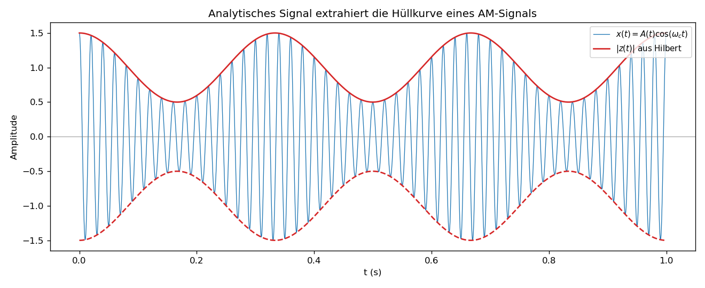

# Einheit 7: Analytisches Signal

## 7.1 Definition

Aus einem reellen Signal \(x(t)\) bildet man das analytische Signal:

$$
z(t)=x(t)+i\mathcal{H}\{x\}(t).
$$

Es kombiniert:

- Realteil: Originalsignal,
- Imaginärteil: Hilbert-Transformierte.

## 7.2 Frequenzbereich

Das analytische Signal enthält keine negativen Frequenzen. Mit \(\operatorname{sgn}(0):=0\) lässt sich das kompakt schreiben als
$$
Z(\omega) = \bigl(1+\operatorname{sgn}(\omega)\bigr)X(\omega).
$$
Aufgeschlüsselt:

$$
Z(\omega)=
\begin{cases}
2X(\omega), & \omega>0,\\
0, & \omega<0,
\end{cases}
$$

und für den Gleichanteil bleibt der Wert bei \(\omega=0\) unverändert. Bei reinen Schwingungen (also bei \(X\), das aus \(\delta\)-Distributionen besteht) entfällt die punktweise Frage; bei der numerischen DFT-Implementierung wird der Gleichanteil \(X[0]\) deshalb **nicht** verdoppelt, alle anderen positiven Bins schon.

Kurz: Negative Frequenzen werden entfernt, positive Frequenzen werden verdoppelt, und der Gleichanteil bleibt erhalten.

## 7.3 Beispiel: Kosinus

Sei

$$
x(t)=A\cos(\omega_0t+\varphi).
$$

Dann:

$$
\mathcal{H}\{x\}(t)=A\sin(\omega_0t+\varphi).
$$

Also:

$$
z(t)
= A\cos(\omega_0t+\varphi)+iA\sin(\omega_0t+\varphi)
= Ae^{i(\omega_0t+\varphi)}.
$$

Das analytische Signal macht Amplitude und Phase direkt sichtbar.

## 7.4 Hüllkurve

Die Hüllkurve ist der Betrag des analytischen Signals:

$$
A(t)=|z(t)|.
$$

Bei amplitudenmodulierten Signalen kann man so die langsam veränderliche Amplitude schätzen.

## 7.5 Momentane Phase

Die momentane Phase ist:

$$
\phi(t)=\arg z(t).
$$

Der Hauptzweig von \(\arg\) liefert Werte in \((-\pi,\pi]\). Sobald die Phase über die Grenze \(\pm\pi\) hinausläuft, springt der Hauptwert um \(2\pi\). Damit die Phase als Funktion der Zeit stetig wird, verwendet man in numerischen Anwendungen das **Phasen-Unwrapping** (z. B. `numpy.unwrap`): Es addiert an jeder Sprungstelle \(\pm 2\pi\), sodass die Sprünge verschwinden, ohne den eigentlichen Phasenverlauf zu verändern.

## 7.6 Momentanfrequenz

Die Momentanfrequenz ist die zeitliche Ableitung der Phase:

$$
\omega_{\text{inst}}(t)=\frac{d}{dt}\phi(t).
$$

In Hertz:

$$
f_{\text{inst}}(t)=\frac{1}{2\pi}\frac{d}{dt}\phi(t).
$$

## 7.7 Typische Anwendung: AM-Signal

Betrachte ein Signal

$$
x(t)=A(t)\cos(\omega_ct),
$$

wobei \(A(t)\) langsam gegenüber der Trägerschwingung \(\cos(\omega_ct)\) variiert. Praktisch bedeutet das: \(A(t)\) ist bandbegrenzt deutlich unterhalb der Trägerfrequenz und im Idealfall nicht negativ.

Diese Spektraltrennung ist der entscheidende Punkt. Unter passenden Bedingungen, oft als Bedrosian-Bedingung formuliert, bleibt die langsamere Amplitude beim Bilden der Quadratur-Komponente von der schnellen Trägerschwingung getrennt.

Dann ist näherungsweise:

$$
z(t)\approx A(t)e^{i\omega_ct}.
$$

Die Hüllkurve \(|z(t)|\) approximiert dann \(A(t)\). Wenn \(A(t)\) das Vorzeichen wechseln kann, liefert die Hüllkurve eher \(|A(t)|\); bei Spektralüberlappung zwischen Modulation und Träger wird die Näherung schlechter.

## 7.8 Visualisierung



Das schnelle Trägersignal \(\cos(\omega_c t)\) ist mit einer langsamen Amplitude \(A(t)=1+0{,}5\cos(2\pi f_m t)\) moduliert. Die Hüllkurve \(|z(t)|\) folgt genau \(A(t)\) — sie ist mit `np.abs(hilbert(x))` in zwei Zeilen Code zu haben.

Kernidee in Python (vollständiges Skript: [`scripts/einheit-7.py`](scripts/einheit-7.py)):

```python
import numpy as np
from scipy.signal import hilbert

fs = 2000.0
t = np.arange(0, 1.0, 1 / fs)
envelope = 1.0 + 0.5 * np.cos(2 * np.pi * 3.0 * t)
signal = envelope * np.cos(2 * np.pi * 50.0 * t)

recovered = np.abs(hilbert(signal))    # ≈ envelope
```

## Übungen zu Einheit 7

1. Bilde das analytische Signal zu \(x(t)=3\cos(10t)\).
2. Was ist die Hüllkurve von \(z(t)=2e^{i(5t+\pi/4)}\)?
3. Was ist die Momentanfrequenz von \(z(t)=e^{i(7t)}\)?
4. Warum entfernt das analytische Signal negative Frequenzen?

Lösungen: [loesungen/einheit-7.md](loesungen/einheit-7.md)

---

[Zurück: Einheit 6 — Hilbert-Transformation](einheit-6.md) · [Index](README.md) · [Weiter: Einheit 8 — Gemeinsames Bild](einheit-8.md)
