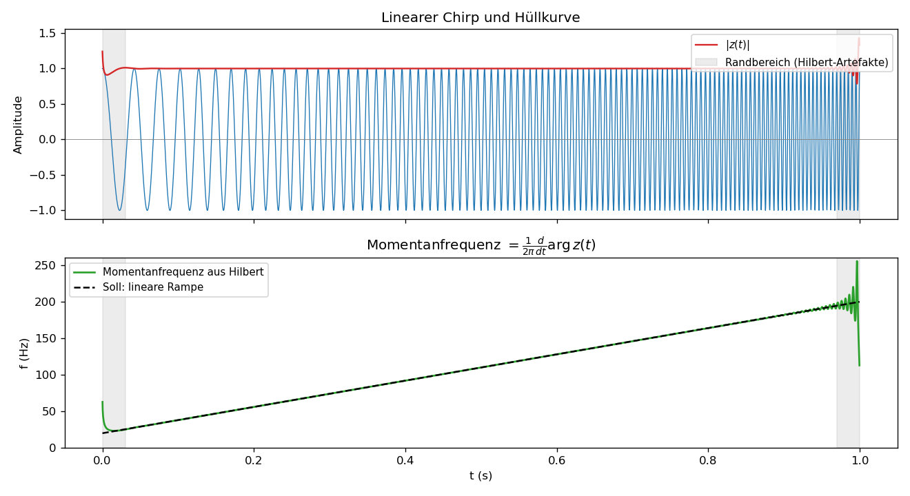

# Einheit 8: Gemeinsames Bild

## 8.1 Die Verbindung der drei Themen

Die Euler-Formel ist die Sprache:

$$
e^{i\omega t}=\cos(\omega t)+i\sin(\omega t).
$$

Die Fourier-Transformation nutzt diese Sprache, um Signale zu zerlegen:

$$
x(t)
=
\frac{1}{2\pi}\int_{-\infty}^{\infty}X(\omega)e^{i\omega t}\,d\omega.
$$

Die Hilbert-Transformation verändert die Phase dieser Frequenzanteile:

$$
X(\omega)
\mapsto
-i\operatorname{sgn}(\omega)X(\omega).
$$

Zusammen ergeben sie ein sehr starkes Werkzeug:

- Euler: komplexe Darstellung von Rotation und Schwingung,
- Fourier: Zerlegung in Schwingungen,
- Hilbert: Konstruktion der Quadratur-Komponente und des analytischen Signals.

## 8.2 Merksätze

1. Komplexe Exponentialfunktionen sind rotierende Zeiger.
2. Sinus und Kosinus sind Kombinationen positiver und negativer komplexer Frequenzen.
3. Fourier-Analyse misst, welche Frequenzen in einem Signal stecken.
4. Zeitverschiebung entspricht Phasenänderung; Skalierung im Zeitbereich entspricht inverser Skalierung im Frequenzbereich.
5. Faltung im Zeitbereich entspricht Multiplikation im Frequenzbereich. LTI-Systeme sind im Frequenzbereich punktweise Multiplikation mit dem Frequenzgang.
6. Die Hilbert-Transformation ist ein LTI-Operator mit Frequenzgang \(-i\operatorname{sgn}(\omega)\); im Zeitbereich Faltung mit \(1/(\pi t)\).
7. Das analytische Signal entfernt negative Frequenzen, erhält den Gleichanteil und macht Amplitude und Phase zugänglich.
8. Zeitliche und spektrale Konzentration stehen in Konkurrenz (Sinc beim Rechteckpuls, Gauß als Optimalfall).

Wer mit einer Implementation arbeitet, sollte zusätzlich die Konventionsfragen aus der [Kurs-Übersicht](README.md#konventionen-und-voraussetzungen) kennen — gerade die Normierung von FFT und die DC-Behandlung beim analytischen Signal sind klassische Stolperfallen.

## 8.3 Visualisierung: Alles auf einmal



Der Chirp \(x(t)=\cos\phi(t)\) hat eine linear wachsende Momentanfrequenz von 20 Hz auf 200 Hz. Aus dem analytischen Signal lässt sich die Momentanfrequenz als Ableitung der entfalteten Phase zurückgewinnen — sie folgt der theoretischen Rampe sehr genau. An den Rändern sind Hilbert-Randeffekte zu sehen; in der Praxis arbeitet man dort mit Fensterung oder ignoriert die Randbereiche.

Kernidee in Python (vollständiges Skript: [`scripts/einheit-8.py`](scripts/einheit-8.py)):

```python
import numpy as np
from scipy.signal import hilbert

fs = 4000.0
t = np.arange(0, 1.0, 1 / fs)
phi = 2 * np.pi * (20.0 * t + 0.5 * 180.0 * t**2)   # f geht von 20 auf 200 Hz
signal = np.cos(phi)

analytic = hilbert(signal)
inst_phase = np.unwrap(np.angle(analytic))
# np.diff lebt auf dem versetzten Gitter (Mittelpunkte zwischen den t-Werten)
inst_freq = np.diff(inst_phase) / (2 * np.pi) * fs   # Momentanfrequenz in Hz
t_freq = (t[:-1] + t[1:]) / 2
```

## 8.4 Abschlussaufgaben

### Aufgabe 1

Schreibe

$$
x(t)=5\cos(4t-\pi/3)
$$

als Summe komplexer Exponentialfunktionen.

### Aufgabe 2

Bestimme die Fourier-Transformierte von \(\delta(t-2)\).

### Aufgabe 3

Sei

$$
x(t)=\cos(8t).
$$

Bestimme:

1. \(\mathcal{H}\{x\}(t)\),
2. das analytische Signal \(z(t)\),
3. die Hüllkurve,
4. die Momentanfrequenz.

### Aufgabe 4

Ein lineares zeitinvariantes System hat Impulsantwort \(h(t)\). Erkläre mit Fourier-Transformation, warum die Ausgabe \(y(t)=x(t)*h(t)\) im Frequenzbereich durch \(Y(\omega)=X(\omega)H(\omega)\) beschrieben wird.

### Aufgabe 5

Ein Signal wird mit \(f_s=8000\,\text{Hz}\) abgetastet. Welche Frequenzen können ohne Aliasing dargestellt werden?

### Aufgabe 6 (Synthese: Euler, Fourier, Hilbert auf einen Schlag)

Gegeben ist das AM-Signal

$$
x(t)=\bigl(1+\tfrac12\cos(2\pi\,5\,t)\bigr)\cos(2\pi\,100\,t).
$$

a) Schreibe \(x\) mit der Euler-Formel als Summe komplexer Schwingungen und gib deren Frequenzen in Hertz an.

b) Skizziere — qualitativ — das Spektrum \(X(f)\) als Linienspektrum (Lage, relative Höhen, Phasen).

c) Begründe mit der Bedrosian-Bedingung, dass das analytische Signal hier \(z(t)=\bigl(1+\tfrac12\cos(2\pi\,5\,t)\bigr)e^{i\,2\pi\,100\,t}\) ist, und gib die Hüllkurve \(|z(t)|\) sowie die Momentanfrequenz \(f_{\text{inst}}(t)\) an.

Lösungen: [loesungen/einheit-8.md](loesungen/einheit-8.md)

---

[Zurück: Einheit 7 — Analytisches Signal](einheit-7.md) · [Index](README.md)
